# Android Game CV Autopilot


Release: `0.1.15c-beta` · Python `3.13` · Android `ADB + Appium` ·
Docker ready · MCP ready · Tests `378 passed` · Local-first module coverage
`100%` · Autopilot Builder coverage `100%` · Deterministic coverage `100%` ·
Subway Surfers local runner smoke passed · Purchases `preview only`

Android Game CV Autopilot is a local Android automation lab for installing
games, passing safe onboarding, running gameplay helpers, navigating to purchase
preview screens, and controlling everything from a bilingual web dashboard or an
MCP-compatible AI client.

It is designed for real Android devices and emulators connected through ADB and
Appium. The default perception mode is local-first: fast frame access,
ROI zones, UIAutomator/text candidates, template matching, optional local
detectors, screen cache, action scheduling, and Vision LLM only as a fallback.
It also includes manual phone control, recorded action replay, custom game
profile construction, named presets, a visual inspector, test runners, and an
MCP bridge.

The dashboard UI supports English and Russian.

Languages: [English](#english) | [Русский](#русская-версия)

## English

## License

This project is source-available for non-commercial use only. Commercial use is prohibited without prior written permission. See [LICENSE](./LICENSE).

## Table Of Contents

- [What It Does](#what-it-does)
- [Safety Model](#safety-model)
- [Architecture](#architecture)
- [Local-First Perception Engine](#local-first-perception-engine)
- [Requirements](#requirements)
- [Quick Start](#quick-start)
- [Docker](#docker)
- [Dashboard](#dashboard)
- [LLM Autopilot Builder](#llm-autopilot-builder)
- [Docs And Development Guide](#docs-and-development-guide)
- [Game Profile And Preset Constructor](#game-profile-and-preset-constructor)
- [MCP Server](#mcp-server)
- [Automation Modes](#automation-modes)
- [Testing And Coverage](#testing-and-coverage)
- [Public Release Checklist](#public-release-checklist)
- [Configuration](#configuration)
- [Project Layout](#project-layout)
- [Troubleshooting](#troubleshooting)
- [Legacy Policy](#legacy-policy)

## What It Does

The project gives you a complete local control surface for Android game
automation:

- Select a connected Android device or emulator.
- Install a game from Play Store or an APK fallback.
- Use local-first perception before calling Vision LLM.
- Use CV autopilot to pass onboarding/tutorial screens with guarded fallback.
- Use fast local gameplay helpers for games that need real-time input.
- Replay saved frame folders without a phone for deterministic perception tests.
- Record manual taps, swipes, text input, and key presses.
- Replay recorded paths as automation stages.
- Navigate to a purchase preview screen and stop before payment confirmation.
- Build new game profiles and reusable presets from the dashboard.
- Inspect screenshots with ROI/candidate overlays and save templates, ROI zones,
  or labels from the dashboard.
- Build reusable autopilot bundles from a prompt: GoalSpec, safety policy,
  screen graph, profile, ROI zones, templates, scenario, replay report,
  live-validation report, patch data, and version history.
- Let MCP-compatible AI clients inspect, edit safe data files, test, and operate
  the system.

Built-in game profiles have different maturity levels. `proven` means a
specific end-to-end scope has evidence; `validated` means a narrower live/replay
scope has evidence. The dashboard reads these statuses from profile JSON and
keeps the validation scope visible.

| Profile | Package | Strategy | Maturity |
| --- | --- | --- | --- |
| `talking-tom` | `com.outfit7.mytalkingtomfree` | CV route | Proven up to purchase preview; live launch/capture/safe exploration also passed on `47d33e1c` |
| `subway-surfers` | `com.kiloo.subwaysurf` | Fast runner helper | Live launch/capture/safe exploration passed on `47d33e1c`; fast gameplay still requires realtime frame source validation |
| `candy-crush` | `com.king.candycrushsaga` | Match-3 helper | Solver unit scope plus live launch/capture/safe exploration passed on `47d33e1c` |
| `brawl-stars` | `com.supercell.brawlstars` | Generic CV | Live launch/capture/safe exploration passed on `47d33e1c`; login/server blockers remain guarded |
| `clash-royale` | `com.supercell.clashroyale` | Generic CV | Generic, not proven on this phone |
| `clash-of-clans` | `com.supercell.clashofclans` | Generic CV | Generic, not proven on this phone |

The dashboard and CLI now expose profile readiness separately from profile
existence. A starter/helper profile is useful for building a route, but it is
not production-ready until replay and live validation pass on the target
device, resolution, language, and app version.

## Safety Model

This project is built for controlled testing. The dashboard and MCP bridge
enforce the same guard rules:

- `PURCHASE_MODE` is forced to `preview` by dashboard-started runs.
- CV may navigate to a shop, offer, billing preview, or price screen.
- Real `Buy`, `Pay`, `Confirm`, subscription, password, biometric, and final
  payment actions remain blocked.
- Google phone verification is manual and user-controlled.
- Preset saving strips secret fields before writing JSON.
- Dashboard project editing is intentionally limited to safe data directories:
  `dashboard/presets`, `dashboard/profiles`, `dashboard/recordings`, and
  `dashboard/prompts`. Server code, Python files, dashboard JS/CSS/HTML, logs,
  reports, caches, virtualenvs, legacy scripts, and known secret files are
  blocked from the web editor.
- Fast gameplay is local-only by design: it uses ROI/tracking/scheduler logic
  and does not call Vision LLM in the real-time loop.
- The project is for local QA, single-player automation experiments, and safe
  UI testing. It does not implement PvP automation, stealth, anti-cheat bypass,
  or payment confirmation.

These restrictions are deliberate. They keep tests repeatable and prevent
accidental real purchases or account-verification abuse.

## Architecture

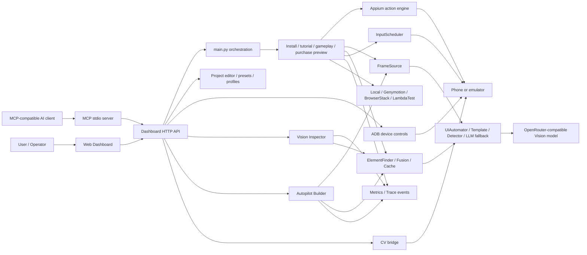

Core layers:

| Layer | Path | Purpose |
| --- | --- | --- |
| Orchestration | `main.py` | Stage ordering, run reports, CLI entrypoint |
| Runtime config | `config.py` | Environment-driven settings |
| Frame sources | `core/frame_source.py` | ADB screenshots, replay frames, and backend selection |
| Perception | `core/perception/` | Candidates, providers, fusion, ROI, stability, cache |
| CV / LLM fallback | `core/cv_engine.py`, `core/cv_autopilot.py` | Vision planning and guarded execution when local providers are not enough |
| Input | `core/input_scheduler.py`, `core/action_engine.py` | Mode-aware taps/swipes, cooldowns, action metrics |
| Gameplay | `core/gameplay/`, `core/fast_runner.py`, `core/match3_solver.py` | Runner and match-3 local helpers |
| Autopilot Builder | `core/autobuilder/` | Goal parsing, safety, app lifecycle, exploration, screen graph, LLM screen analysis, profile/ROI/template/scenario generation, bundles, replay/live validation, repair, review, versioning, eval |
| Profiles | `core/game_profiles.py` | Built-in/custom routing hints and percent-based screen zones |
| Scenarios | `scenarios/` | Install, tutorial, gameplay, payment-preview flows |
| Services | `services/` | Local device, device farms, provider clients |
| Metrics | `core/metrics.py` | Trace schema, latency counters, dashboard payloads |
| Dashboard | `dashboard/server.py`, `dashboard/static/`, `dashboard/api_vision.py` | Web UI, HTTP API, constructor, manual mode, visual inspector |
| MCP | `dashboard/mcp_server.py` | AI-client bridge over stdio |
| Tests | `tests/` | Unit, mocked integration, live ADB smoke tests |

Docker runtime flow:

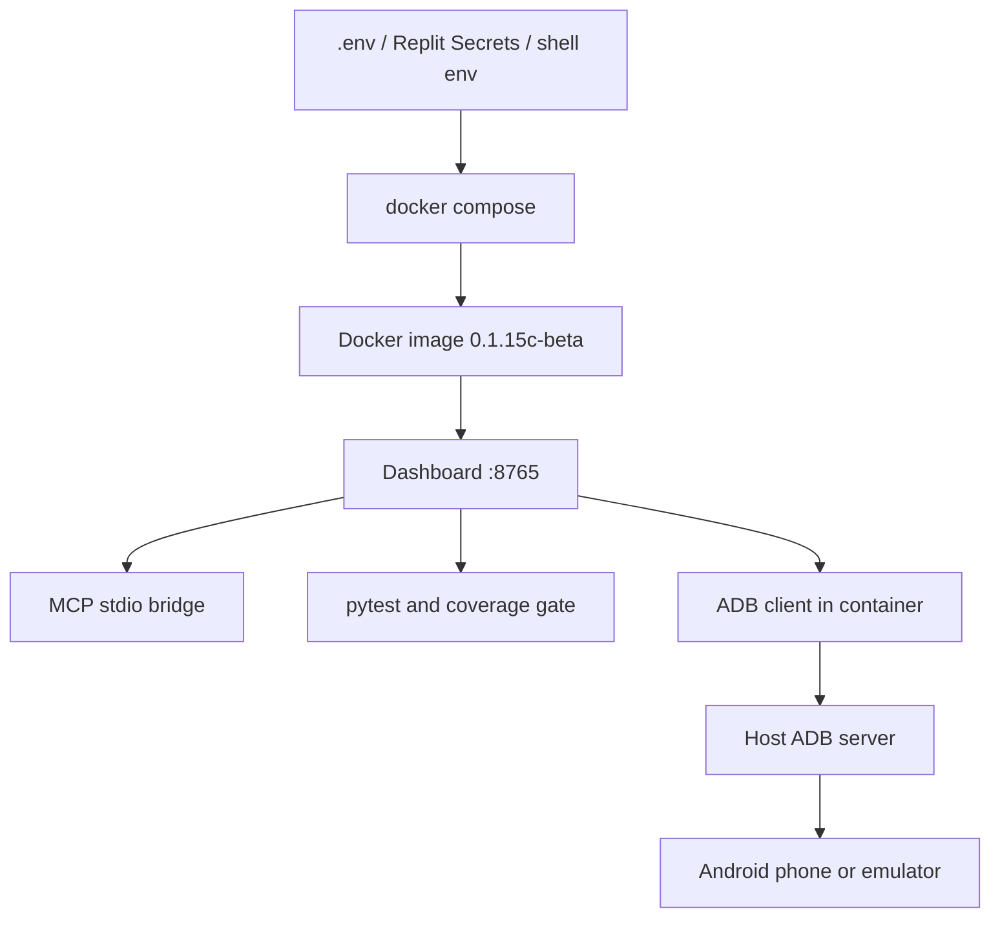

AI/MCP construction flow:

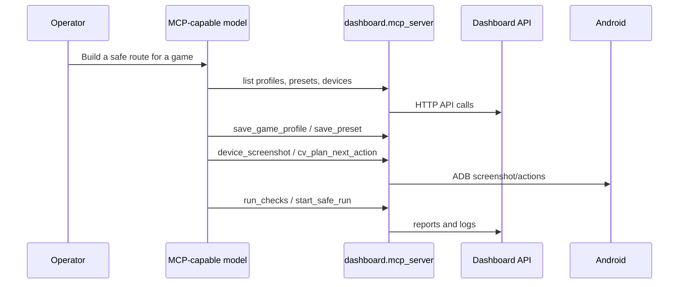

## Local-First Perception Engine

The current perception path is intentionally layered so the slowest tool is used
last:

```text
FrameSource.latest_frame()
  -> ScreenStabilityDetector
  -> ROISelector(profile, state)
  -> ElementFinder(goal, roi)
  -> Providers: UIAutomator, Template, Detector, LLM fallback
  -> FusionEngine.rank_candidates()
  -> PolicyGuard / scenario logic
  -> InputScheduler.execute()
  -> Metrics + Trace + Dashboard overlay
```

Implemented rollout flags:

| Variable | Values | Meaning |
| --- | --- | --- |
| `PERCEPTION_MODE` | `local_first` default; also `llm_first`, `shadow`, `local_only` | Controls provider order and fallback behavior |
| `FRAME_SOURCE` | `adb`, `adb_raw`, `screenrecord`, `replay`, `scrcpy`, `minicap` | Selects capture backend; `adb_raw` avoids Android-side PNG encoding, `screenrecord`/`scrcpy` need host `ffmpeg`/`scrcpy`, and `minicap` needs device-side minicap files |
| `ACTION_MODE` | `menu`, `fast` | Chooses safe menu pauses or fast gameplay pauses |
| `ENABLE_TEMPLATE_PROVIDER` | `true` / `false` | Enables template matching |
| `ENABLE_UIAUTOMATOR_PROVIDER` | `true` / `false` | Enables native Android text/UI candidates |
| `ENABLE_LLM_FALLBACK` | `true` / `false` | Allows Vision fallback outside local-only loops |
| `ENABLE_DETECTOR_PROVIDER` | `true` / `false` | Enables optional local detector provider |

Local providers share one result model, `ElementCandidate`, with bbox, center,
confidence, source, text, screen ID, and latency. `FusionEngine` scores
candidates with confidence, ROI, text match, provider priority, recency, and
stale-frame penalties.

The Vision planner is schema-bound before execution. Model output is parsed into
a strict action schema, normalized through an action whitelist (`tap`, `type`,
`press`, `swipe`, `wait`, `done`, `fail`), checked against screen bounds and
required fields, and retried through a bounded JSON repair loop when malformed.
Invalid plans turn into a safe `wait` result instead of arbitrary coordinates.
Trace payloads are redacted before they are written to disk.

Profiles now support percent-based `screen_zones`, so the same profile can work
across 720p, 1080p, 1440p, and different aspect ratios. Templates live under
`assets/templates/` with registry metadata for thresholds, scales, ROI names,
tap offsets, and negative templates.

`ScreenStateCache` stores perceptual hashes, recent candidates, last action,
resolution, profile ID, and ROI hashes for repeated screens. `ElementFinder`
uses the cache before providers, so a repeated stable screen can reuse prior
local/LLM candidates. `ReplayFrameSource` lets perception tests run from saved
PNG frames with no connected phone. `ScrcpyFrameSource` uses real `scrcpy` plus
`ffmpeg` frame extraction, and `MinicapFrameSource` reads the minicap socket
protocol when minicap is installed on the device.

Fast gameplay uses `RunnerPlugin` and `InputScheduler` instead of the generic
Vision loop. Runner state includes `STARTING`, `RUNNING`, `JUMPING`, `DUCKING`,
`LANE_SWITCHING`, `RECOVERING`, `GAME_OVER`, and `UNKNOWN`, with cooldown keys,
danger prediction, lane score velocity, and frame-skip policy.

The detailed implementation ledger is kept in
[docs/perception_roadmap.md](docs/perception_roadmap.md). It lists every
completed PR-sized item, changed files, tests, coverage gate, and the real
Subway Surfers smoke result.

## Requirements

- macOS or Linux.
- Python 3.13 tested locally.
- Android SDK platform tools with `adb`.
- Appium setup for local Appium-driven runs.
- Connected Android device or emulator with USB debugging enabled.
- Optional OpenRouter-compatible Vision key for CV mode.

Run the setup doctor before the first run:

```bash
python3 scripts/setup_doctor.py --latency
```

The doctor checks Python, local-first dependencies, ADB, connected devices,
Docker ADB bridge settings, optional Vision key configuration, and can measure
ADB screenshot latency. It exits non-zero only on hard failures.

Measure reaction speed directly:

```bash
python3 scripts/reaction_benchmark.py --serial emulator-5554 --samples 5 --source adb
python3 scripts/reaction_benchmark.py --serial 47d33e1c --samples 5 --source adb_raw
python3 scripts/profile_live_validator.py --serial 47d33e1c --profile subway-surfers --promote validated
python3 scripts/benchmark_matrix.py --serial 47d33e1c --profile subway-surfers --runs 20
```

Interpreting latency:

| Capture path | Typical use |
| --- | --- |
| `<=80 ms` | Local-first menu loops and light realtime helpers |
| `80-180 ms` | Menus/tutorials; use streaming for action gameplay |
| `>180 ms` | Too slow for fast gameplay; use `replay`, a validated streaming source, or `minicap` plus local-only runtime |

Install Python dependencies:

```bash
python3 -m pip install -r requirements.txt
```

Check Android devices:

```bash
adb devices -l
```

App launches use Android package resolution plus `am start -n`; the builder no
longer relies on `monkey -p`. ADB operations in `AppManager` have bounded
retry/backoff for common race states such as offline/closed/temporary transport
errors.

If more than one device is connected, set `LOCAL_DEVICE` to the serial shown by
`adb devices -l`:

```bash
export LOCAL_DEVICE=<adb-serial>
```

## Quick Start

Start the dashboard:

```bash
python3 -m dashboard.server
```

Open:

```text
http://127.0.0.1:8765
```

Default local login:

```text
username: admin
password: change-me
```

Change dashboard credentials through environment variables:

```bash
export DASHBOARD_USERNAME=admin
export DASHBOARD_PASSWORD=change-me
export DASHBOARD_MCP_API_KEY=change-this-mcp-key
```

Recommended first run:

1. Open `Command`.
2. Select a ready preset, for example `Verified: My Talking Tom`.
3. Select the connected ADB device and click `Use For Run`.
4. Enter a Vision key if using CV mode.
5. Click `Run Checks`.
6. Click `Start Safe Run`.
7. Watch `Logs` and `Reports`.

CLI profile listing:

```bash
python3 main.py --list-games
```

CLI run example:

```bash
python3 main.py --game talking-tom --stages install,tutorial,purchase_preview
```

## Docker

Docker is the recommended reproducible deployment path for the dashboard, MCP
API surface, tests, and release checks. Secrets stay outside the image.

### Local Dashboard

```bash
cp .env.example .env
# edit .env and replace admin/change-me values before exposing the dashboard
docker compose up --build
```

Open:

```text
http://127.0.0.1:8765
```

Default local Docker login is controlled by `.env`:

```text
DASHBOARD_USERNAME=admin
DASHBOARD_PASSWORD=change-me
DASHBOARD_MCP_API_KEY=change-me
```

### Docker Tests

Run the complete Docker release check:

```bash
bash scripts/docker_check.sh
```

When the container cannot reach a host ADB server, the live ADB smoke test is
reported as skipped. That is expected for a pure Docker build check.

Or run only compose validation and tests:

```bash
docker compose config
docker compose run --rm dashboard python -m pytest -q
```

### ADB From Docker

Docker Desktop on macOS cannot directly see a USB phone. The container uses the
host ADB server through:

```text
ADB_SERVER_SOCKET=tcp:host.docker.internal:5037
```

Start a host ADB server that listens for the local container network:

```bash
adb kill-server
adb -a -P 5037 nodaemon server start
```

Keep that terminal open, then run:

```bash
docker compose up --build
docker compose exec dashboard adb devices -l
```

Use this only on a trusted local machine/network. For cloud deployment, prefer
Genymotion, BrowserStack, LambdaTest, or another explicitly reachable ADB
target.

### MCP With Docker

If your AI client runs on the host, keep MCP as a host-side stdio process and
point it to the Docker dashboard:

```json
{
  "mcpServers": {
    "android-autopilot-dashboard": {
      "command": "python3",
      "args": ["-m", "dashboard.mcp_server"],
      "cwd": "/absolute/path/to/android",
      "env": {
        "DASHBOARD_URL": "http://127.0.0.1:8765",
        "DASHBOARD_MCP_API_KEY": "change-me"
      }
    }
  }
}
```

The model can then use MCP tools to inspect devices, create profiles, save
presets, run checks, test CV, capture screenshots, and start guarded runs.

## Replit

The repository is configured for Replit. Press `Run` and Replit starts the web
dashboard through:

```bash
bash scripts/replit_start.sh
```

Replit defaults:

| Variable | Value |
| --- | --- |
| `DASHBOARD_HOST` | `0.0.0.0` |
| `DASHBOARD_PORT` | `8765` |
| `DASHBOARD_USERNAME` | `admin` |
| `DASHBOARD_PASSWORD` | Set in Replit Secrets |
| `DASHBOARD_MCP_API_KEY` | Set in Replit Secrets |
| `PURCHASE_MODE` | `preview` |
| `GOOGLE_PHONE_MODE` | `manual` |

Use Replit Secrets for real API keys:

```text
OPENROUTER_API_KEY
DASHBOARD_PASSWORD
DASHBOARD_MCP_API_KEY
GENYMOTION_API_TOKEN
BROWSERSTACK_USERNAME
BROWSERSTACK_ACCESS_KEY
LT_USERNAME
LT_ACCESS_KEY
```

Useful Replit shell commands:

```bash
bash scripts/replit_check.sh
bash scripts/replit_mcp.sh
python3 main.py --list-games
```

Important ADB note: a cloud Repl cannot see a USB phone connected to your local
computer. In Replit, use a remote device provider such as Genymotion,
BrowserStack, LambdaTest, or an ADB target reachable from the Repl. Local USB
ADB stays available when running this repo on your own machine.

## Dashboard

The dashboard is the primary control surface. It is modern, bilingual, and built
for both manual operation and AI-assisted automation.

| Section | What It Controls |
| --- | --- |
| `Command` | Game, device farm, run stages, methods, credentials, CV prompts, recordings, presets |
| `MCP` | MCP server command, client config, exposed tool names |
| `Manual` | Live screenshot, tap, swipe, key, text input, action recording, and replay |
| `CV Bench` | Write a CV goal prompt, plan one action, or run a short guarded CV loop |
| `Vision Inspector` | Screenshot overlay with ROI zones, provider boxes, confidence, latency, and editing actions |
| `Builder` | Prompt-to-autopilot builder with GoalSpec, safety checks, bundle save, replay/live validation, patch data, and version history |
| `Project` / `Data Files` | Guarded editor for safe dashboard data files only |
| `Profiles` | Create, edit, apply, and delete custom game profiles |
| `Guide` | English/Russian explanations of how the constructor works |
| `Reports` | Latest run report and check output |
| `Logs` | Tail of the dashboard-started automation process |

Dashboard API examples:

| Endpoint | Purpose |
| --- | --- |
| `GET /api/state` | Full dashboard state |
| `POST /api/run` | Start a guarded automation run |
| `POST /api/stop` | Stop an active run |
| `POST /api/check` | Compile active code, run pytest, run coverage gate |
| `GET /api/profiles` | List built-in and custom game profiles |
| `POST /api/profiles` | Save a custom profile |
| `POST /api/profiles/delete` | Delete a custom profile file |
| `GET /api/presets` | List named presets |
| `POST /api/presets` | Save a named preset |
| `POST /api/cv/plan` | Ask CV for one next action without executing |
| `POST /api/cv/run` | Run safe CV autopilot on the current screen |
| `GET /api/vision/inspector` | Read latest screenshot, ROI, candidates, metrics, and selected element |
| `POST /api/vision/templates` | Save the selected/cropped area as a template asset |
| `POST /api/vision/roi` | Add a normalized ROI zone to a custom profile |
| `POST /api/vision/labels` | Export a manual label JSON record |
| `GET /api/builder/state` | List saved autopilot bundles and default builder models |
| `POST /api/builder/build` | Build an autopilot bundle from a goal prompt |
| `GET /api/device/screenshot` | Capture selected Android screen |
| `POST /api/device/tap` | Tap by coordinates through ADB |
| `POST /api/device/swipe` | Swipe by coordinates through ADB |
| `POST /api/recordings/replay` | Replay a recorded action path |

Manual recorder behavior:

- Button swipes support up, down, left, and right.
- The phone screenshot also supports direct drag gestures; drag on the image to
  create a recorded `swipe`.
- Recordings keep real time between user actions by writing `pause` on the
  previous action. The last action uses `pause: 0`.
- CV Test Bench lets you type a goal prompt, plan one CV step with
  `POST /api/cv/plan`, or run a short guarded CV loop with `POST /api/cv/run`.
- Vision Inspector draws the latest ROI/candidate overlay and can save a
  selected region as a template, create a profile ROI, or export a label record.
- Builder takes a prompt, selected package/device, optional replay frames, and
  the current Vision key/model list, then writes an `autopilots/<id>/` bundle.

### Dashboard Screenshots

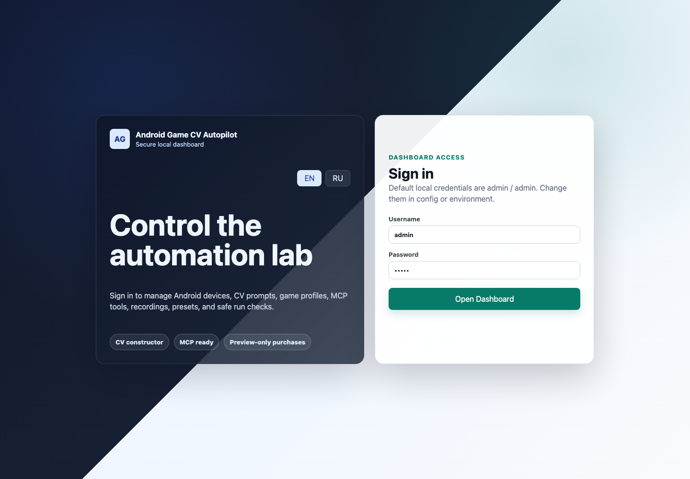

Login protects the local dashboard with configurable credentials. Local
development defaults are `admin` / `change-me`. The server refuses to bind
outside localhost with weak dashboard password or MCP API key defaults.

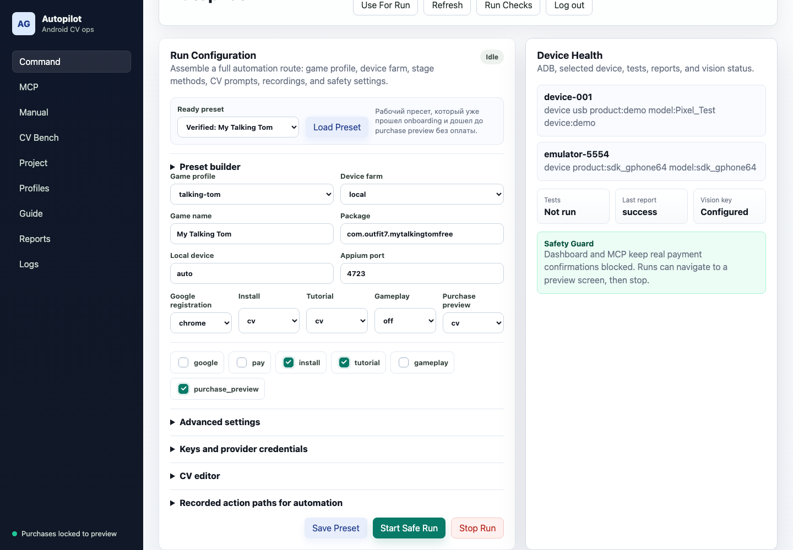

`Command` is the main run builder: choose a game profile, device farm, stage
methods, CV prompts, recordings, credentials for the next run, and safe
purchase-preview behavior.

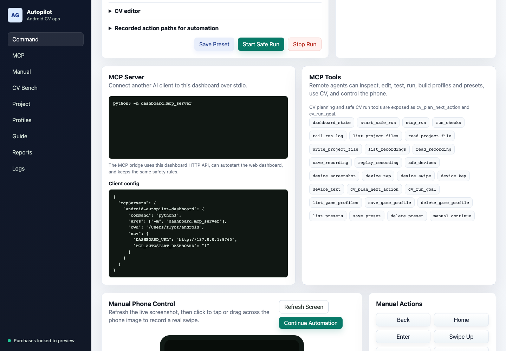

`MCP` shows the stdio command, client configuration, API key setup, and the
tool surface exposed to external AI clients.

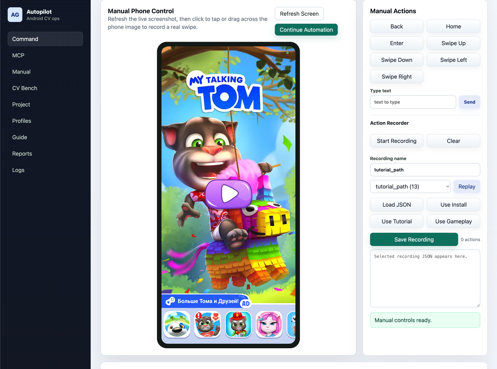

`Manual` gives direct operator control over the selected Android screen. It can
tap, type, send keys, swipe in four directions, drag on the screenshot to create
a real swipe, record actions, and replay saved paths.

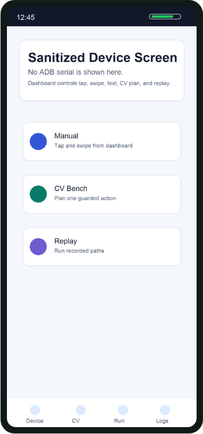

Device screenshots in the README are sanitized. They do not expose an ADB
serial or private phone content.

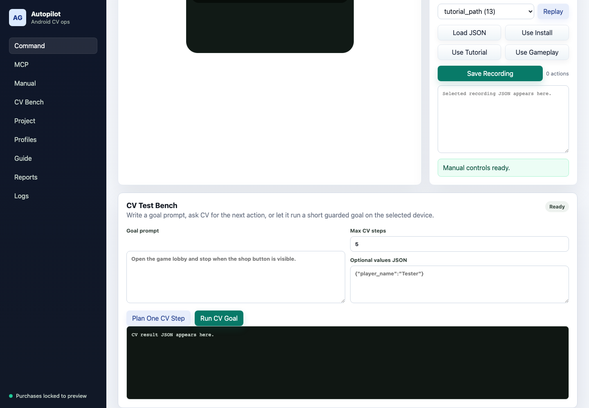

`CV Bench` is an interactive prompt lab. Type a goal, plan one CV action, or run
a short guarded CV loop on the current device before saving the route into a
preset.

`Vision Inspector` sits next to the CV/manual tools. It shows candidate boxes,
provider source, confidence, selected action, ROI zones, and latency metrics,
then lets you turn a useful region into a template, ROI, or label file.
After a CV run, click `Refresh Inspector`. Orange is the active ROI, blue boxes
are provider candidates, green is the selected element, and a purple box is a
manual region you draw by dragging on the screenshot. `Save Template` and
`Create ROI` use the purple manual box first; if no manual box is drawn, they
use the green selected element.
The `Saved artifact` block shows the exact file path and JSON returned by the
save action. ROI saves also enable `Open Profile JSON`, which jumps to the
Project editor so you can inspect or edit `dashboard/profiles/<profile>.json`.
Template saves show the crop path under `assets/templates/...` and the registry
path.
The Inspector also has a `Templates` library. Click `Refresh Templates` to list
the current template registry, see matched PNG files, and use a saved template
back in the form. Template saves write `template id`, `namespace`, ROI name, and
threshold into `assets/templates/registry.json`.

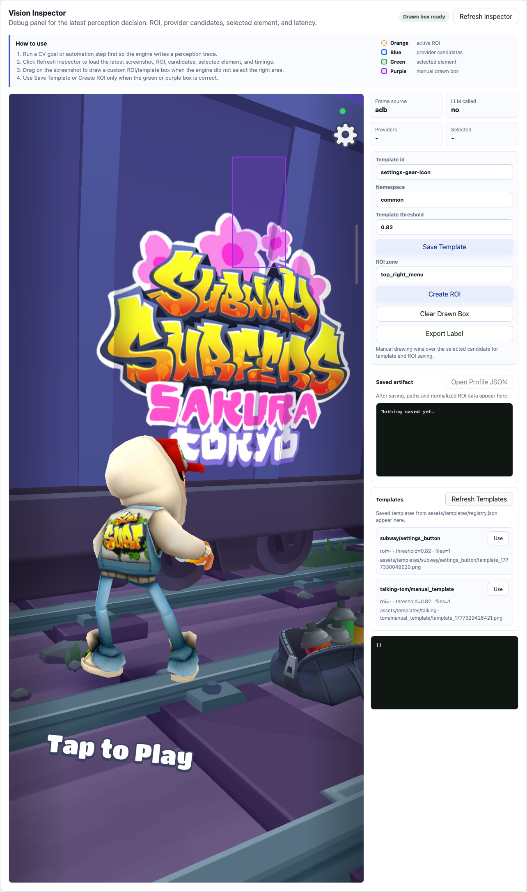

This screenshot shows the Inspector with overlay, save controls, and template
library in one place. It is the primary local-perception debugging surface.

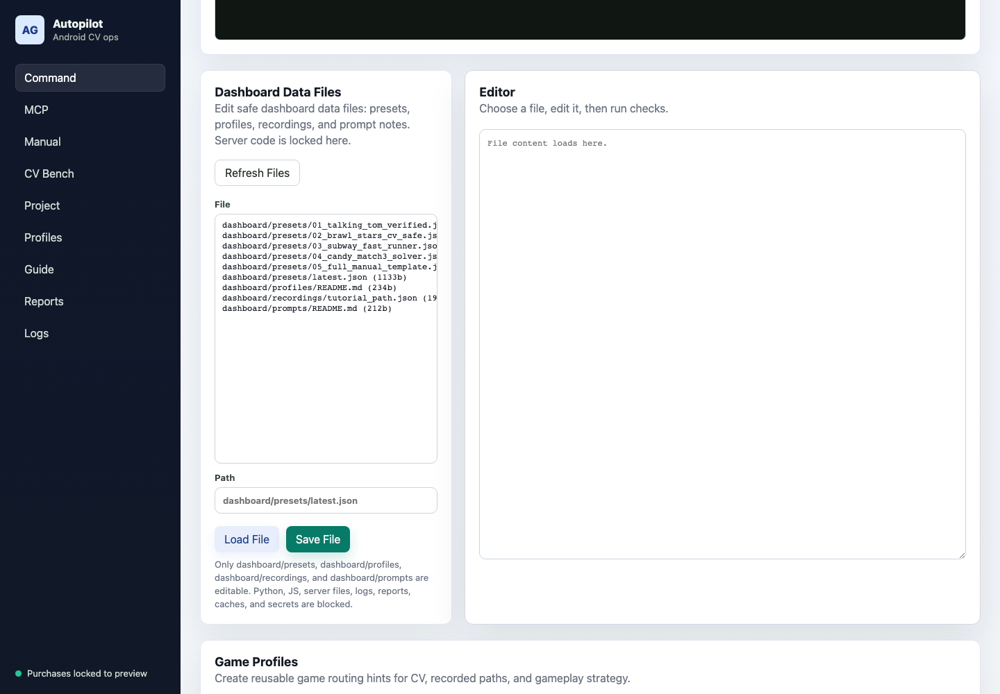

`Data Files` is intentionally scoped to safe JSON/notes: presets, profiles,
recordings, and prompt notes. Server code and dashboard source files are not
editable from this panel.

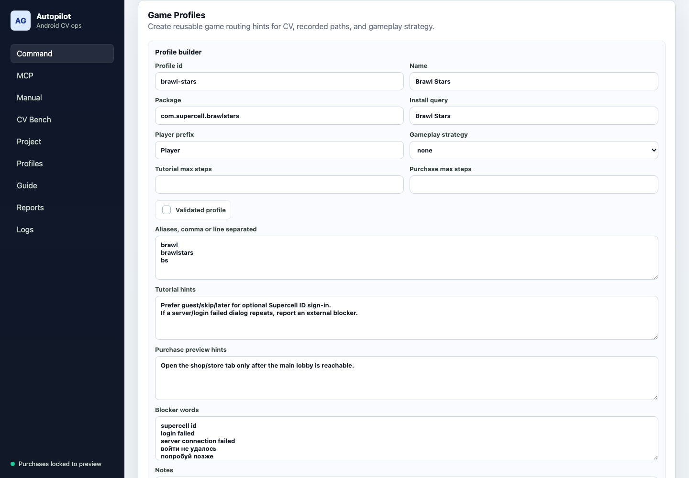

`Profiles` is the constructor for new games. A profile defines package name,
Play Store query, CV hints, blocker words, gameplay strategy, validation notes,
step limits, and normalized `screen_zones` used by local perception.

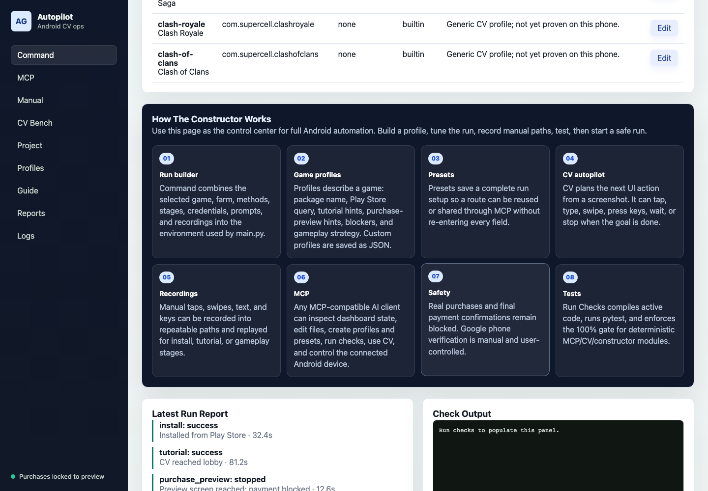

`Guide` explains the constructor, profiles, presets, CV autopilot, recordings,
MCP, Vision Inspector, Autopilot Builder, tests, and safety rules.

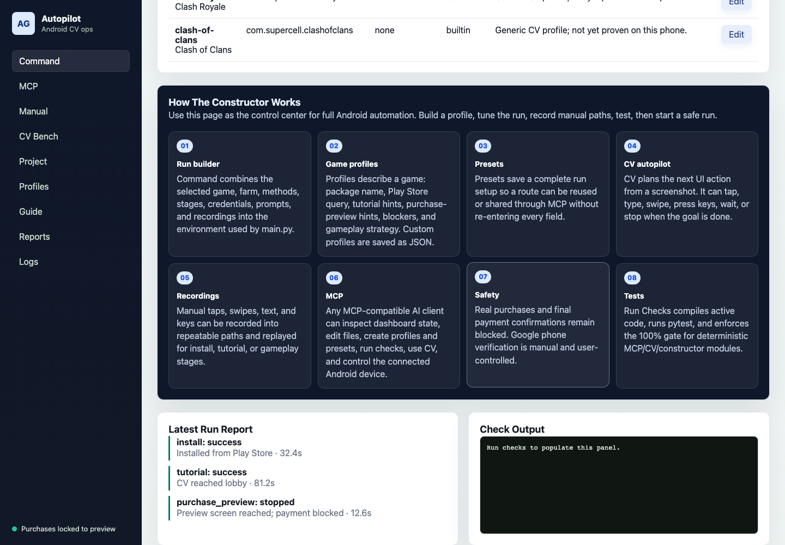

`Reports` and `Logs` show the latest run timeline, check output, and active
dashboard-started automation log tail.

## LLM Autopilot Builder

The Builder tab turns a high-level prompt into a saved local-first autopilot
bundle. The LLM is used as a builder and screen analyst, not as a realtime
player. Runtime execution still goes through local frame capture, screen
stability, ROI, templates/UIAutomator/local providers, `PolicyGuard`, and
`InputScheduler`.

Input:

- Goal prompt.
- Builder mode: `create`, `improve`, `repair`, `validate`, or `shadow`.
- Optional package name, selected ADB serial, replay frame paths, and live
  validation toggle.
- OpenRouter/Vision key and model list from the dashboard credentials fields.

Output:

```text
autopilots/<autopilot_id>/
  autopilot.json
  profile.json
  scenario.json
  screen_graph.json
  safety_policy.json
  templates/
  replays/frames/
  reports/build_report.json
  patches/
  version_history.json
```

Implemented builder modules live under `core/autobuilder/`:

- Goal parsing, schema validation, budgets, and redaction.
- Safety policy and review-gated `PolicyGuard`.
- App launch/stop/package inspection through `AppManager`.
- `ScreenGraph`, `Explorer`, and `BuildContext`.
- Structured LLM screen analysis with schema validation and safety filtering.
- Profile, ROI, scenario, and template generation.
- Atomic artifact writes, bundle save/load, replay tests, live validation,
  self-healing patch proposals, human review queue, version history, and eval
  metrics.

Dashboard endpoints:

- `GET /api/builder/state`
- `POST /api/builder/build`

Focused builder verification currently covers 44 tests. The implementation
ledger is in `docs/autopilot_builder_implementation_status.md`.

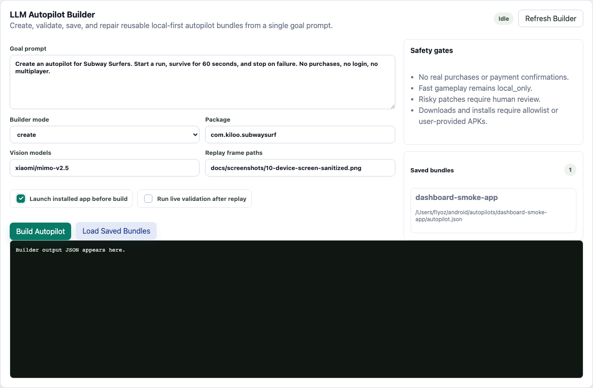

The Builder view is the operator-facing prompt-to-autopilot screen: prompt,
mode, package, replay/live toggles, saved bundles, and raw output.

## Docs And Development Guide

- [Development Guide](docs/development_guide.md)
- [Dashboard Guide](docs/dashboard_guide.md)
- [Perception Roadmap](docs/perception_roadmap.md)
- [Autopilot Builder Plan](docs/autopilot_builder_plan.md)
- [Autopilot Builder Implementation Status](docs/autopilot_builder_implementation_status.md)

## Game Profile And Preset Constructor

The constructor lets you create automation routes for new games without editing
Python code.

Custom game profiles are saved in:

```text
dashboard/profiles/*.json
```

A profile describes:

- `id`
- game name
- Android package
- Play Store install query
- aliases
- tutorial hints
- purchase-preview hints
- blocker words
- gameplay strategy
- normalized `screen_zones`
- max tutorial/purchase steps
- notes and validation status

Template assets are stored under:

```text
assets/templates/
```

The optional template registry can define threshold, ROI, scales, tap offset,
and negative templates per visual element. Dashboard Inspector editing endpoints
can add new template crops and update `assets/templates/registry.json`.

Named presets are saved in:

```text
dashboard/presets/*.json
```

A preset stores a complete run form:

- selected profile and package
- selected device farm
- stage list
- install/tutorial/gameplay/purchase-preview methods
- CV prompt overrides
- recorded action paths
- gameplay helper settings
- safe preview settings

Secrets are not saved into presets.

## MCP Server

Run the MCP server:

```bash
python3 -m dashboard.mcp_server
```

Example MCP client config:

```json
{
  "mcpServers": {
    "android-autopilot-dashboard": {
      "command": "python3",
      "args": ["-m", "dashboard.mcp_server"],
      "cwd": "/absolute/path/to/android",
      "env": {
        "DASHBOARD_URL": "http://127.0.0.1:8765",
        "MCP_AUTOSTART_DASHBOARD": "1",
        "DASHBOARD_MCP_API_KEY": "change-me"
      }
    }
  }
}
```

The MCP bridge forwards tool calls to the dashboard HTTP API. Browser UI and AI
clients share the same run state, logs, profiles, presets, recordings, guarded
data-file editor, CV tools, device controls, and safety guards.

MCP authenticates with the dashboard through `DASHBOARD_MCP_API_KEY`. The local
example value is `change-me`; set a strong value before exposing the dashboard
outside localhost.

More MCP details are in [dashboard/MCP.md](dashboard/MCP.md).

### MCP Tool Groups

| Group | Tools |
| --- | --- |
| State and reports | `dashboard_state`, `tail_run_log`, `latest_report` |
| Runs and tests | `start_safe_run`, `stop_run`, `run_checks`, `run_benchmark_matrix` |
| Data files | `list_project_files`, `read_project_file`, `write_project_file` |
| Recordings | `list_recordings`, `read_recording`, `save_recording`, `replay_recording` |
| Constructor | `list_game_profiles`, `save_game_profile`, `delete_game_profile`, `list_presets`, `save_preset`, `delete_preset` |
| CV | `cv_plan_next_action`, `cv_run_goal` |
| Vision Inspector | `vision_inspector_state`, `list_vision_templates`, `save_vision_template`, `create_vision_roi`, `export_vision_label` |
| Autopilot Builder | `autopilot_builder_state`, `build_autopilot` |
| Android device | `adb_devices`, `device_screenshot`, `device_tap`, `device_swipe`, `device_key`, `device_text` |
| Manual checkpoints | `manual_continue` |

### MCP Workflows

Create a game route through an AI client:

1. Call `list_game_profiles`.
2. Call `save_game_profile` with a new profile JSON.
3. Call `save_preset` with the full run configuration.
4. Call `run_checks`.
5. Use `device_screenshot`, `cv_plan_next_action`, or `vision_inspector_state`
   to inspect the current UI and latest perception trace.
6. Save a local perception asset with `save_vision_template` or
   `create_vision_roi`.
7. Build a reusable autopilot bundle with `autopilot_builder_state` and
   `build_autopilot`.
8. Start the guarded run with `start_safe_run`.

Use CV through MCP:

- `cv_plan_next_action` captures a screenshot and returns a single planned UI
  action. It does not execute the action.
- `cv_run_goal` runs the safe CV loop on the connected Android screen. Risky
  payment/purchase actions stop the loop instead of being executed.

### Smart Model Workflow

You can connect a stronger MCP-compatible model and give it a high-level task,
for example:

```text
Create a safe automation preset for <game name>. Use the dashboard MCP tools to
inspect connected devices, create or update a game profile, tune CV prompts,
save a preset, run checks, inspect screenshots, and iterate until the route can
install the game, pass onboarding, and stop at purchase preview.
```

The model can then use the MCP tools end to end:

1. Read `dashboard_state` and `adb_devices`.
2. Create a new custom profile with `save_game_profile`.
3. Save a reusable route with `save_preset`.
4. Inspect the phone with `device_screenshot`.
5. Inspect the last perception decision with `vision_inspector_state`, then
   save a template or ROI when useful.
6. Build a prompt-driven autopilot with `autopilot_builder_state` and
   `build_autopilot`.
7. Test CV behavior with `cv_plan_next_action` and `cv_run_goal`.
8. Use `run_checks` after changing profiles, presets, recordings, or prompt
   notes.
9. Start the guarded route with `start_safe_run` and monitor `tail_run_log` and
   `latest_report`.

This is the intended path for adapting the constructor to another game. The
model can edit safe dashboard data files, profiles, presets, recordings, and
prompt notes, but the dashboard/MCP file guard blocks server code and secret
files. Real purchase confirmation remains blocked by the same safety guard.

## Automation Modes

| Mode | Use Case |
| --- | --- |
| `cv` | Guarded menu/tutorial flow; local-first providers or Vision fallback depending on `PERCEPTION_MODE` |
| `manual` | Human-controlled step with live screen and manual checkpoint |
| `recorded` | Replay previously recorded taps/swipes/text/keys |
| `deterministic` | Hard-coded deterministic flow where available |
| `fast` | Local high-speed gameplay helper with `RunnerPlugin`, cooldowns, and no Vision calls |
| `auto` | Select an appropriate gameplay helper from profile/config |
| `off` | Skip a stage |

Stage examples:

```bash
RUN_STAGES=install,tutorial,purchase_preview python3 main.py --game talking-tom
```

```bash
INSTALL_AUTOPILOT_VIA=cv \
GAME_AUTOPILOT_VIA=recorded \
RECORDED_TUTORIAL_PATH=dashboard/recordings/tutorial.json \
python3 main.py --game custom
```

## Testing And Coverage

Current local status:

```text
Full local regression: 378 passed, 3 skipped without OPENROUTER_API_KEY
Clean requirements venv: pip check passed, PIL/numpy/cv2/httpx/appium imported
Live ADB local-first smoke: passed on emulator-5554 with real screenshot/template matching
Live OpenRouter CV+Builder smoke: passed on emulator-5554 with xiaomi/mimo-v2.5 and 4 real ADB exploration actions
Benchmark matrix smoke: subway-surfers 1/1 launch+capture run passed on USB device 47d33e1c
Local-first module coverage gate: 100.00%
Autopilot Builder coverage gate: 100.00%
Deterministic constructor/MCP/CV coverage gate: 100.00%
Subway Surfers local runner smoke: passed on device 47d33e1c
Profile live validation: 4 installed profiles passed launch/capture/safe exploration on device 47d33e1c
```

The `378 passed` figure is not a claim that every profile has 378 live E2E
runs. It is the repository regression suite: unit tests, contract tests, mocked
integration boundaries, static checks, and live smoke tests that skip when a
Vision key is missing or the connected screen is locked/too flat for template
matching. Live proof is reported separately through smoke tests, profile
validation reports, and benchmark-matrix JSON reports.

Run all active tests:

```bash
python3 -m pytest -q
```

Run compile checks:

```bash
python3 -m compileall -q core dashboard scenarios services tests bootstrap.py main.py config.py
```

Run a clean dependency smoke:

```bash
tmpdir=$(mktemp -d /tmp/android-req-smoke-XXXXXX)
python3 -m venv "$tmpdir/venv"
"$tmpdir/venv/bin/python" -m pip install --upgrade pip
"$tmpdir/venv/bin/python" -m pip install -r requirements.txt
"$tmpdir/venv/bin/python" -m pip check
```

Run the live local-first ADB smoke on a connected device or emulator:

```bash
LOCAL_DEVICE=emulator-5554 python3 -m pytest tests/test_live_adb_smoke.py -q
```

Run the live OpenRouter + Builder smoke on a real frame:

```bash
OPENROUTER_API_KEY=... CV_MODELS=xiaomi/mimo-v2.5 LOCAL_DEVICE=emulator-5554 \
  python3 -m pytest tests/test_live_openrouter_smoke.py -q
```

Run a release-style device/profile matrix. Use `--runs 20` for evidence you can
compare between devices, Android versions, resolutions, and app/profile
versions:

```bash
python3 scripts/benchmark_matrix.py --serial 47d33e1c --profile subway-surfers --runs 20
```

Run the dashboard-equivalent check pipeline:

```bash
curl -sS -X POST http://127.0.0.1:8765/api/check \
  -H 'Content-Type: application/json' \
  -H 'X-Dashboard-Api-Key: change-me' \
  -d '{}'
```

Run the 100% coverage gate for deterministic constructor/MCP/CV modules:

```bash
python3 -m pytest \
  tests/test_dashboard_mcp_server.py \
  tests/test_cv_prompt_templates.py \
  tests/test_dashboard_cv_bridge.py \
  tests/test_game_profiles.py \
  --cov=dashboard.mcp_server \
  --cov=core.cv_prompt_templates \
  --cov=dashboard.cv_bridge \
  --cov=core.game_profiles \
  --cov-report=term-missing \
  --cov-fail-under=100 \
  -q
```

Run the 100% coverage gate for the Autopilot Builder:

```bash
python3 -m pytest \
  tests/test_goal_spec.py \
  tests/test_task_parser.py \
  tests/test_autobuilder_budgets.py \
  tests/test_autobuilder_schemas.py \
  tests/test_autobuilder_safety_policy.py \
  tests/test_autobuilder_redaction.py \
  tests/test_app_manager.py \
  tests/test_screen_graph.py \
  tests/test_build_context.py \
  tests/test_explorer.py \
  tests/test_screen_analyst.py \
  tests/test_profile_generator.py \
  tests/test_roi_generator.py \
  tests/test_scenario_generator.py \
  tests/test_template_miner.py \
  tests/test_artifact_store.py \
  tests/test_autopilot_bundle.py \
  tests/test_replay_test_runner.py \
  tests/test_live_validation.py \
  tests/test_self_healing.py \
  tests/test_patch_review.py \
  tests/test_autopilot_versioning.py \
  tests/test_autopilot_eval_suite.py \
  tests/test_autopilot_builder_e2e.py \
  tests/test_dashboard_builder_api.py \
  tests/test_autobuilder_coverage_edges.py \
  --cov=core.autobuilder \
  --cov=dashboard.api_builder \
  --cov-report=term-missing \
  --cov-fail-under=100
```

Run the 100% coverage gate for the local-first perception/gameplay/inspector
modules:

```bash
python3 -m pytest \
  tests/test_config_feature_flags.py \
  tests/test_metrics.py \
  tests/test_input_scheduler.py \
  tests/test_frame_source_replay.py \
  tests/test_default_perception_factory.py \
  tests/test_roi_selector.py \
  tests/test_screen_stability.py \
  tests/test_element_fusion.py \
  tests/test_element_finder_contract.py \
  tests/test_template_provider.py \
  tests/test_uiautomator_provider.py \
  tests/test_screen_state_cache.py \
  tests/test_llm_provider.py \
  tests/test_dashboard_vision_inspector.py \
  tests/test_dashboard_vision_editing.py \
  tests/test_runner_plugin.py \
  tests/test_fast_runner_gameplay.py \
  tests/test_match3_gameplay.py \
  tests/test_match3_scoring.py \
  tests/test_detector_provider.py \
  tests/test_cv_autopilot.py \
  --cov=core.metrics \
  --cov=core.input_scheduler \
  --cov=core.frame_source \
  --cov=core.perception.defaults \
  --cov=core.perception.roi \
  --cov=core.perception.screen_stability \
  --cov=core.perception.element \
  --cov=core.perception.fusion \
  --cov=core.perception.finder \
  --cov=core.perception.template_registry \
  --cov=core.perception.providers.template_provider \
  --cov=core.perception.providers.uiautomator_provider \
  --cov=core.perception.state_cache \
  --cov=core.perception.providers.llm_provider \
  --cov=dashboard.api_vision \
  --cov=core.gameplay.base_plugin \
  --cov=core.gameplay.runner_plugin \
  --cov=core.perception.providers.detector_provider \
  --cov=scenarios.fast_runner_gameplay \
  --cov=scenarios.match3_gameplay \
  --cov=core.cv_autopilot \
  --cov-report=term-missing \
  --cov-fail-under=100 \
  -q
```

Run mocked integration boundaries:

```bash
python3 -m pytest tests/test_integration_mocks.py -q
```

Run read-only live ADB smoke against a connected phone or emulator:

```bash
python3 -m pytest tests/test_live_adb_smoke.py -q
```

Run the dashboard i18n/UI contract tests:

```bash
python3 -m pytest tests/test_dashboard_i18n_contract.py -q
```

Run the public-surface secret scan:

```bash
bash scripts/secret_scan.sh
```

### Coverage Policy

The project separates coverage into focused categories:

| Category | Coverage Target | Why |
| --- | --- | --- |
| Local-first perception/gameplay/inspector | 100% gate | Frame sources, ROI, providers, fusion, cache, scheduler, runner, dashboard inspector |
| Deterministic code | 100% gate | MCP protocol, prompt templates, CV bridge helpers, profile parsing |
| Integration code | Mocked and live tests | ADB, Appium, Google, Play Store, device farms, HTTP providers |

Full repository line coverage is intentionally not claimed as 100%. Android,
Appium, Google, Play Store, provider, and real-device flows need mocked
integration tests plus live device smoke tests, not fake unit coverage.

## Public Release Checklist

Release beta:

```text
0.1.15c-beta
```

Before publishing to a public GitHub repository:

1. Keep real secrets in `.env`, Replit Secrets, shell environment, or your MCP
   client config. Do not commit them. If a key was ever public, revoke/rotate it
   at the provider first; deleting it from the latest commit is not enough.
2. Run the active tests:

```bash
python3 -m pytest -q
```

3. Run the deterministic 100% coverage gate:

```bash
python3 -m pytest \
  tests/test_dashboard_mcp_server.py \
  tests/test_cv_prompt_templates.py \
  tests/test_dashboard_cv_bridge.py \
  tests/test_game_profiles.py \
  --cov=dashboard.mcp_server \
  --cov=core.cv_prompt_templates \
  --cov=dashboard.cv_bridge \
  --cov=core.game_profiles \
  --cov-report=term-missing \
  --cov-fail-under=100 \
  -q
```

4. Run the local-first 100% coverage gate listed in [Testing And Coverage](#testing-and-coverage).

5. Run the secret scan:

```bash
bash scripts/secret_scan.sh
```

If a credential reached git history, remove the file/path from all history with
`git filter-repo` or BFG and coordinate the force-push:

```bash
git filter-repo --path REQUIREMENTS.md --invert-paths
git push --force-with-lease origin main
```

6. Validate Docker:

```bash
docker compose config
bash scripts/docker_check.sh
```

7. Commit and tag:

```bash
git add .
git commit -m "Release beta 0.1.15c"
git tag -a beta-0.1.15c -m "Beta 0.1.15c"
```

8. Push only after a remote is configured:

```bash
git remote add origin git@github.com:<owner>/<repo>.git
git push -u origin main
git push origin beta-0.1.15c
```

Public repo hygiene:

- `.gitignore` and `.dockerignore` exclude `.env`, `credentials.json`, logs,
  reports, traces, local screenshots, virtualenvs, caches, `legacy/`, and
  `archive/`.
- Dashboard screenshots in `docs/screenshots/` do not expose ADB serials.
- Dashboard device labels mask serials in the UI while keeping the real serial
  internally for ADB actions.
- Docker images do not bake API keys into the filesystem or image layers.

## Configuration

Most behavior is configured through environment variables and can also be set
from the dashboard form.

Common variables:

| Variable | Purpose |
| --- | --- |
| `OPENROUTER_API_KEY` | Vision model key |
| `CV_MODELS` | Comma-separated Vision model fallback list; defaults to `xiaomi/mimo-v2.5` |
| `CV_MODEL_ATTEMPTS` | Retry count per Vision model for transient empty/null provider responses; defaults to `3` |
| `CV_MAX_TOKENS` | Vision response token budget; defaults to `4096` so reasoning models can still return final JSON |
| `CV_JSON_REPAIR_ATTEMPTS` | Bounded repair attempts for malformed Vision planner JSON; defaults to `1` |
| `PERCEPTION_MODE` | Default `local_first`; supports `llm_first`, `shadow`, `local_first`, or `local_only` |
| `FRAME_SOURCE` | `adb`, `adb_raw`, `screenrecord`, `replay`, `scrcpy`, or `minicap`; `adb_raw` avoids Android PNG encoding, `screenrecord` requires host `ffmpeg`, `scrcpy` requires host `scrcpy` + `ffmpeg`, `minicap` requires device minicap files |
| `ACTION_MODE` | `menu` for safe pauses or `fast` for realtime gameplay |
| `ENABLE_TEMPLATE_PROVIDER` | Enable local template matching |
| `ENABLE_UIAUTOMATOR_PROVIDER` | Enable native Android text/UI candidates |
| `ENABLE_LLM_FALLBACK` | Permit Vision fallback outside local-only loops |
| `ENABLE_DETECTOR_PROVIDER` | Enable optional detector provider |
| `DETECTOR_MODEL_PATH` | Optional ONNX/local detector model path |
| `DETECTOR_CONFIDENCE_THRESHOLD` | Minimum detector confidence |
| `DEVICE_FARM` | `local`, `genymotion`, `browserstack`, or `lambdatest` |
| `LOCAL_DEVICE` | ADB serial or `auto` |
| `APPIUM_PORT` | Local Appium port |
| `GAME_PROFILE` | Profile id |
| `GAME_NAME` | Display/search name override |
| `GAME_PACKAGE` | Android package override |
| `RUN_STAGES` | Comma-separated stage list |
| `INSTALL_AUTOPILOT_VIA` | `cv`, `deterministic`, `manual`, `recorded` |
| `GAME_AUTOPILOT_VIA` | Tutorial/onboarding method |
| `GAMEPLAY_AUTOPILOT_VIA` | `auto`, `fast`, `manual`, `recorded`, `off` |
| `PURCHASE_AUTOPILOT_VIA` | Purchase preview method |
| `PURCHASE_MODE` | Dashboard forces `preview` |
| `RECORDED_INSTALL_PATH` | Recording path for install stage |
| `RECORDED_TUTORIAL_PATH` | Recording path for tutorial stage |
| `RECORDED_GAMEPLAY_PATH` | Recording path for gameplay stage |
| `MANUAL_CONTROL_TIMEOUT_SECONDS` | Manual checkpoint timeout |
| `DASHBOARD_AUTH_ENABLED` | Enable/disable local dashboard login, default `1` |
| `DASHBOARD_USERNAME` | Dashboard username, default `admin` |
| `DASHBOARD_PASSWORD` | Dashboard password, default `change-me`; weak values are rejected for non-localhost binds |
| `DASHBOARD_SESSION_TTL_SECONDS` | Browser session lifetime |
| `DASHBOARD_MCP_API_KEY` | API key used by MCP and other non-browser clients |

Provider credentials:

| Variable | Purpose |
| --- | --- |
| `GENYMOTION_API_TOKEN` | Genymotion Cloud |
| `BROWSERSTACK_USERNAME` | BrowserStack username |
| `BROWSERSTACK_ACCESS_KEY` | BrowserStack access key |
| `LT_USERNAME` | LambdaTest username |
| `LT_ACCESS_KEY` | LambdaTest access key |
| `FIVESIM_API_KEY` | 5sim key for permitted non-Google flows |
| `GOOGLE_PHONE_NUMBER` | Manual Google phone number |
| `GOOGLE_SMS_CODE` | Manual Google SMS code |
| `GOOGLE_SMS_CODE_FILE` | File watched for manual SMS code |

Do not commit real credentials.

## Project Layout

```text
bootstrap.py                         Preflight configuration/API checks
config.py                            Environment-driven runtime config
main.py                              Automation entrypoint and stage orchestration
core/
  metrics.py                         Trace schema and latency counters
  frame_source.py                    ADB/replay frame source abstraction
  input_scheduler.py                 Menu/fast action scheduling and cooldowns
  cv_engine.py                       Vision API client and JSON parsing
  cv_autopilot.py                    Screenshot -> plan -> guarded execution loop
  cv_prompt_templates.py             CV prompt templates
  game_profiles.py                   Built-in/custom game profile registry
  perception/
    element.py                       Shared ElementCandidate model
    finder.py                        Local-first provider orchestration
    fusion.py                        Candidate scoring/ranking
    roi.py                           Percent screen zones and ROI conversion
    screen_stability.py              Frame-diff stability detector
    state_cache.py                   Perceptual screen cache
    template_registry.py             Template metadata loading
    providers/                       UIAutomator, template, detector, LLM adapters
  gameplay/
    base_plugin.py                   Shared gameplay action result
    runner_plugin.py                 Runner state machine and danger prediction
  autobuilder/
    goal_spec.py                     Prompt-derived GoalSpec model
    safety_policy.py                 Builder safety boundaries
    app_manager.py                   Controlled ADB app lifecycle
    explorer.py                      Safe screen exploration
    screen_graph.py                  Screen and transition graph
    screen_analyst.py                Structured LLM screen analysis
    profile_generator.py             Profile defaults and runtime policy
    roi_generator.py                 Percent-based ROI generation
    template_miner.py                Template crop/save/verification
    scenario_generator.py            Automation scenario generation
    bundle.py                        Autopilot bundle save/load
    replay_test_runner.py            Offline replay validation
    live_validation.py               ADB live validation report
    self_healing.py                  Patch proposal engine
    review.py                        Human patch approval queue
    versioning.py                    Version history and rollback
    eval_suite.py                    Autopilot quality metrics
  appium_action_engine.py            Device action abstraction
scenarios/
  install_game_cv.py                 Play Store/APK install flow
  game_tutorial_cv.py                First-run/tutorial CV flow
  purchase_preview_cv.py             Safe purchase-preview navigation
  fast_runner_gameplay.py            Realtime runner helper
  match3_gameplay.py                 Match-3 helper
services/
  local_farm.py                      Local ADB/Appium target
  browserstack_farm.py               BrowserStack API boundary
  lambdatest_farm.py                 LambdaTest API boundary
  genymotion_farm.py                 Genymotion API boundary
  sms_service.py                     SMS provider boundary
dashboard/
  server.py                          Web dashboard HTTP API
  api_builder.py                     Autopilot Builder API helpers
  api_vision.py                      Vision Inspector payload/editing helpers
  mcp_server.py                      MCP stdio bridge
  cv_bridge.py                       Dashboard CV planning/execution helpers
  static/                            HTML/CSS/JS/i18n assets
  presets/                           Named run presets
  profiles/                          Custom game profile JSON files
  recordings/                        Saved manual action recordings
  prompts/                            Optional dashboard-editable prompt notes
assets/
  templates/                         Template crops and optional registry.json
tests/                               Active pytest suite
legacy/                              Old probes/scripts excluded from active coverage
```

## Troubleshooting

### ADB device not visible

```bash
adb devices -l
```

If the phone is missing:

- Enable USB debugging.
- Accept the RSA prompt on the phone.
- Reconnect USB or restart ADB:

```bash
adb kill-server
adb start-server
adb devices -l
```

### Multiple devices connected

Set a concrete serial:

```bash
export LOCAL_DEVICE=<adb-serial>
```

Then refresh the dashboard and click `Use For Run`.

### CV models fail

Check:

- `OPENROUTER_API_KEY` is set or entered in the dashboard.
- `CV_MODELS` contains valid Vision-capable models.
- The Android screenshot endpoint returns a PNG:

```bash
adb -s <serial> exec-out screencap -p > /tmp/android-screen.png
```

### Local perception finds the wrong element

Use `PERCEPTION_MODE=shadow` to compare local providers against the existing LLM
path without letting local candidates drive the action. Check the Vision
Inspector overlay for ROI, source, confidence, latency, and selected candidate.
Raise template thresholds or narrow the profile `screen_zones` when a local
provider is too broad.

### Replay perception without a phone

Set `FRAME_SOURCE=replay` in tests or local scripts and point the replay source
at a folder of PNG frames. This keeps template, ROI, fusion, cache, and
stability debugging deterministic when no Android device is connected.

### Fast mode taps too aggressively

Use `ACTION_MODE=fast` only for gameplay helpers that own their cooldown policy.
Runner actions include cooldown keys for lane changes, jump, and duck. For menu
or tutorial screens, keep `ACTION_MODE=menu`.

### Dashboard port is busy

Find the process:

```bash
lsof -iTCP:8765 -sTCP:LISTEN -n -P
```

Stop it or start dashboard on another port:

```bash
DASHBOARD_PORT=8766 python3 -m dashboard.server
```

### Appium/local run fails

Confirm Appium is running and that `APPIUM_PORT` matches the dashboard field:

```bash
export APPIUM_PORT=4723
```

### Play Store/game blocked by network or region

Use one of:

- another game profile,
- APK fallback path,
- manual mode,
- recorded action path,
- remote device farm with the right region.

## Legacy Policy

Old root-level probes, experiments, one-off sign-in scripts, and scratch tests
were moved to `legacy/`. They are excluded from active dashboard editing and
coverage gates.

Bring a legacy file back only after:

1. Defining the supported behavior.
2. Moving it into an active module.
3. Adding focused tests.
4. Running the full pytest suite.

## Security Notes

- Do not commit API keys, SMS credentials, cloud provider credentials, Google
  credentials, or card data.
- Dashboard presets strip known secret fields.
- Dashboard browser access is protected by login when `DASHBOARD_AUTH_ENABLED=1`.
- MCP/API clients use `X-Dashboard-Api-Key` or `Authorization: Bearer <key>`.
- The dashboard file editor is restricted to `dashboard/presets`,
  `dashboard/profiles`, `dashboard/recordings`, and `dashboard/prompts`.
- `credentials.json`, `.env`, server code, Python files, dashboard JS/CSS/HTML,
  logs, reports, caches, virtualenvs, and `legacy/` are excluded from the
  dashboard project editor.
- Real payment confirmation remains blocked by guard rules.

## Русская Версия

Android Game CV Autopilot — локальная лаборатория автоматизации Android-игр.
Проект умеет устанавливать игры, проходить безопасный onboarding/tutorial,
запускать gameplay-помощники, доходить до preview-экрана покупки и
останавливаться до реального подтверждения оплаты. Управление доступно из
двуязычного web dashboard и через MCP-совместимые AI-клиенты.

Текущая архитектура — local-first: сначала быстрые локальные источники кадров,
ROI, UIAutomator/text, шаблоны, optional detector, cache и scheduler; Vision LLM
используется только как fallback для неизвестных или неоднозначных экранов.

### Что Умеет

- Выбор подключенного телефона или эмулятора через ADB.
- Установка игры из Play Store или APK fallback.
- Local-first perception перед Vision LLM.
- CV-автопилот по скриншотам для onboarding, tutorial и меню с guarded fallback.
- Fast gameplay helpers без Vision LLM в realtime loop.
- Replay сохраненных кадров без телефона для детерминированных perception tests.
- Ручной режим с live screenshot, tap, swipe, key и text input.
- Запись действий с реальным временем между действиями.
- Воспроизведение записанных путей как этапов автоматизации.
- Конструктор игровых профилей, ROI zones, templates и пресетов.
- Vision Inspector: overlay с ROI, candidate boxes, confidence, latency,
  provider source и действиями save template / create ROI / export label.
- LLM Autopilot Builder: по промпту создает GoalSpec, safety policy,
  screen graph, profile, ROI zones, templates, scenario, replay/live reports,
  patch data и version history.
- MCP bridge, чтобы другая нейронка могла читать состояние, запускать тесты,
  управлять телефоном, использовать CV и создавать профили/пресеты.

### Безопасность

Dashboard и MCP запускают покупки только в режиме `preview`.
Реальные `Buy`, `Pay`, `Confirm`, подписки, пароль, биометрия и финальное
подтверждение оплаты заблокированы guard-правилами. Google phone verification
остается ручной и под контролем пользователя.

Fast gameplay рассчитан на локальные QA/single-player сценарии. Проект не
реализует PvP automation, stealth, anti-cheat bypass или подтверждение оплаты.

Редактор файлов в dashboard не редактирует код сервера. Разрешены только
безопасные data-директории:

```text
dashboard/presets
dashboard/profiles
dashboard/recordings
dashboard/prompts
```

`config.py`, `main.py`, `dashboard/server.py`, dashboard JS/CSS/HTML, секреты,
логи, отчеты, кеши, virtualenv и `legacy/` заблокированы в web-редакторе.

### Local-First Perception

Основной pipeline:

```text
FrameSource.latest_frame()
  -> ScreenStabilityDetector
  -> ROISelector(profile, state)
  -> ElementFinder(goal, roi)
  -> Providers: UIAutomator, Template, Detector, LLM fallback
  -> FusionEngine.rank_candidates()
  -> PolicyGuard / scenario logic
  -> InputScheduler.execute()
  -> Metrics + Trace + Dashboard overlay
```

`PERCEPTION_MODE=shadow` нужен для безопасного rollout: локальные providers
считаются и логируются, но не управляют действием. `local_first` сначала
использует UIAutomator/templates/detector/cache, а Vision вызывает только при
низкой confidence. `local_only` подходит для fast gameplay и replay tests.

Vision planner перед выполнением проходит строгую схему. Ответ модели
разбирается как JSON, нормализуется через whitelist действий (`tap`, `type`,
`press`, `swipe`, `wait`, `done`, `fail`), проверяется по границам экрана и
обязательным полям, а malformed JSON получает ограниченный repair retry.
Невалидный план превращается в безопасный `wait`, а trace перед записью
проходит redaction секретов, телефонов, email и платежных полей.

`FRAME_SOURCE=adb` использует текущий ADB PNG screenshot путь,
`FRAME_SOURCE=adb_raw` забирает raw framebuffer без PNG-энкодинга на Android,
`FRAME_SOURCE=screenrecord` пробует H.264 stream через `adb screenrecord` +
host `ffmpeg`, `FRAME_SOURCE=replay` читает сохраненные PNG frames,
`FRAME_SOURCE=scrcpy` использует host `scrcpy` и `ffmpeg` для получения кадра, а
`FRAME_SOURCE=minicap` читает minicap socket stream, если minicap установлен на
устройстве.

Подробный ledger по внедрению хранится в
[docs/perception_roadmap.md](docs/perception_roadmap.md): там перечислены
готовые PR-блоки, измененные файлы, тесты, coverage gate и реальный smoke на
Subway Surfers.

### Зрелость Профилей И Скорость

Проект не заявляет, что каждый builtin profile уже универсально проходит любую
версию игры. Dashboard показывает maturity/readiness отдельно:

| Статус | Что значит |
| --- | --- |
| `proven` / `validated` | Прошел replay/live validation в заявленном scope |
| `helper` | Есть локальный gameplay/helper, но профиль не универсален |
| `starter` | Стартовый набор hints/ROI/blockers, требует validation |
| `blocked` | Уперся во внешний blocker: login/server/region/account |

Перед первым запуском проверь окружение:

```bash
python3 scripts/setup_doctor.py --latency
```

Проверить скорость реакции ADB capture отдельно:

```bash
python3 scripts/reaction_benchmark.py --serial emulator-5554 --samples 5 --source adb
python3 scripts/reaction_benchmark.py --serial 47d33e1c --samples 5 --source adb_raw
python3 scripts/profile_live_validator.py --serial 47d33e1c --profile subway-surfers --promote validated
python3 scripts/benchmark_matrix.py --serial 47d33e1c --profile subway-surfers --runs 20
```

Если `adb_screencap` или `adb_raw_screencap` показывает больше `180 ms`, этот
путь подходит для меню и tutorial, но не для fast gameplay. Для быстрых игр
нужен `FRAME_SOURCE=replay`, реально проверенный streaming source или `minicap`
и `PERCEPTION_MODE=local_only`.

Запуск приложений в Builder/AppManager делается через Android
`cmd package resolve-activity --brief` и `am start -n`, а не через `monkey -p`.
ADB-команды AppManager имеют bounded retry/backoff для типичных race-состояний
transport/device offline/closed/temporary unavailable.

### Быстрый Старт

```bash
python3 -m pip install -r requirements.txt
python3 scripts/setup_doctor.py
python3 -m dashboard.server
```

Открыть:

```text
http://127.0.0.1:8765
```

Логин по умолчанию:

```text
login: admin
password: change-me
```

Настройка логина и MCP API key:

```bash
export DASHBOARD_USERNAME=admin
export DASHBOARD_PASSWORD=change-me
export DASHBOARD_MCP_API_KEY=change-this-mcp-key
```

Проверить устройства:

```bash
adb devices -l
```

Если подключено несколько устройств:

```bash
export LOCAL_DEVICE=<adb-serial>
```

### Replit

Проект настроен для Replit. Кнопка `Run` запускает web dashboard через:

```bash
bash scripts/replit_start.sh
```

В Replit по умолчанию:

| Переменная | Значение |
| --- | --- |
| `DASHBOARD_HOST` | `0.0.0.0` |
| `DASHBOARD_PORT` | `8765` |
| `DASHBOARD_USERNAME` | `admin` |
| `DASHBOARD_PASSWORD` | Задай в Replit Secrets |
| `DASHBOARD_MCP_API_KEY` | Задай в Replit Secrets |
| `PURCHASE_MODE` | `preview` |
| `GOOGLE_PHONE_MODE` | `manual` |

Реальные ключи добавляй через Replit Secrets:

```text
OPENROUTER_API_KEY
DASHBOARD_PASSWORD
DASHBOARD_MCP_API_KEY
GENYMOTION_API_TOKEN
BROWSERSTACK_USERNAME
BROWSERSTACK_ACCESS_KEY
LT_USERNAME
LT_ACCESS_KEY
```

Полезные команды в Replit Shell:

```bash
bash scripts/replit_check.sh
bash scripts/replit_mcp.sh
python3 main.py --list-games
```

Важно про ADB: облачный Repl не увидит USB-телефон, подключенный к твоему Mac.
В Replit используй Genymotion, BrowserStack, LambdaTest или ADB target,
доступный из Repl. Локальный USB ADB работает при запуске проекта на этом ПК.

### Docker

Docker — основной воспроизводимый путь для запуска dashboard, MCP API,
тестов и release checks. Секреты не запекаются в image.

Локальный запуск dashboard:

```bash
cp .env.example .env
# отредактируй .env и замени admin/change-me перед внешним доступом
docker compose up --build
```

Открыть:

```text
http://127.0.0.1:8765
```

Логин и MCP key берутся из `.env`:

```text
DASHBOARD_USERNAME=admin
DASHBOARD_PASSWORD=change-me
DASHBOARD_MCP_API_KEY=change-me
```

Полная Docker-проверка релиза:

```bash
bash scripts/docker_check.sh
```

Если контейнер не видит host ADB server, live ADB smoke test будет помечен как
skipped. Для чистой Docker build-проверки это нормально.

Быстрая проверка Docker Compose и тестов:

```bash
docker compose config
docker compose run --rm dashboard python -m pytest -q
```

ADB из Docker на macOS работает через host ADB server:

```text
ADB_SERVER_SOCKET=tcp:host.docker.internal:5037
```

Запусти ADB server на хосте в отдельном терминале:

```bash
adb kill-server
adb -a -P 5037 nodaemon server start
```

Потом:

```bash
docker compose up --build
docker compose exec dashboard adb devices -l
```

Используй этот режим только на доверенной локальной машине/сети. Для облака
лучше использовать Genymotion, BrowserStack, LambdaTest или другой явно
доступный ADB target.

MCP с Docker: если AI-клиент работает на хосте, запускай MCP как host-side
stdio процесс и направляй его на Docker dashboard:

```json
{
  "mcpServers": {
    "android-autopilot-dashboard": {
      "command": "python3",
      "args": ["-m", "dashboard.mcp_server"],
      "cwd": "/absolute/path/to/android",
      "env": {
        "DASHBOARD_URL": "http://127.0.0.1:8765",
        "DASHBOARD_MCP_API_KEY": "change-me"
      }
    }
  }
}
```

Модель через MCP сможет смотреть устройства, создавать профили, сохранять
presets, запускать checks, тестировать CV, делать screenshots и стартовать
guarded runs.

### Dashboard

| Раздел | Назначение |
| --- | --- |
| `Command` | Игра, ферма устройств, этапы, методы, ключи, CV prompts, recordings, presets |
| `MCP` | Команда MCP server, client config, список tools |
| `Manual` | Live screen, tap, swipe, key, text, запись и replay действий |
| `CV стенд` | Цель/промпт для CV, планирование одного шага или короткий guarded CV run |
| `Vision Inspector` | Screenshot overlay с ROI, boxes, confidence, latency и editing actions |
| `Builder` | Prompt-to-autopilot builder: GoalSpec, safety, bundle save, replay/live validation, patches и версии |
| `Project` / `Data Files` | Защищенный редактор только safe data files |
| `Profiles` | Создание, применение и удаление custom game profiles |
| `Guide` | Подробные объяснения RU/EN |
| `Reports` | Последний run report и вывод проверок |
| `Logs` | Лог процесса, запущенного из dashboard |

В ручном режиме можно:

- нажимать кнопки `Swipe Up`, `Swipe Down`, `Swipe Left`, `Swipe Right`;
- тянуть мышью/пальцем по screenshot телефона, чтобы записать настоящий swipe;
- записывать реальные интервалы: `pause` ставится на предыдущее действие, а
  последнее действие получает `pause: 0`;
- сохранять JSON в `dashboard/recordings/*.json` и потом воспроизводить.
- В CV Test Bench можно написать цель/промпт, спланировать один CV шаг через
  `POST /api/cv/plan` или запустить короткую guarded CV-цель через
  `POST /api/cv/run`.
- Vision Inspector показывает ROI/candidates поверх screenshot и может
  сохранить выбранную область как template, добавить ROI в профиль или
  экспортировать label JSON.
- Builder принимает промпт, package/device, replay frames и текущие Vision
  key/models, затем сохраняет bundle в `autopilots/<id>/`.

### Скриншоты Dashboard


`Login` защищает локальный dashboard. По умолчанию логин/пароль `admin` /
`admin`, но их можно поменять через environment.


`Command` — главный конструктор запуска: игра, ферма устройств, этапы, методы,
CV prompts, recordings, credentials для следующего run и безопасный режим
purchase preview.


`MCP` показывает команду запуска stdio server, client config, API key и список
tools, доступных внешним AI-клиентам.


`Manual` дает ручное управление телефоном: tap, text, key, свайпы вверх/вниз/
влево/вправо, drag по screenshot для настоящего swipe, запись и replay paths.


Скриншоты устройства в README очищены: ADB serial и приватное содержимое
телефона не показываются.


`CV стенд` — тестовая зона для промптов. Можно написать цель, получить один
планируемый CV action или запустить короткую guarded CV loop на текущем экране.

`Vision Inspector` показывает boxes, provider source, confidence, ROI zones,
выбранное действие и latency metrics. Из него можно сохранить crop как
template, создать ROI zone в custom profile или экспортировать label.
После CV-запуска нажми `Обновить инспектор`. Оранжевый цвет — активная ROI,
синий — candidates от providers, зеленый — выбранный элемент, фиолетовый —
ручная область, которую ты чертишь мышью прямо по screenshot. `Сохранить
шаблон` и `Создать ROI` сначала используют фиолетовую ручную
рамку; если её нет, берут зеленый selected element.
Блок `Что сохранено` показывает точный путь файла и JSON-ответ сохранения. Для
ROI включается кнопка `Открыть profile JSON`: она прыгает в Project editor и
открывает `dashboard/profiles/<profile>.json`, где можно посмотреть или
изменить зоны. Для template показывается путь crop-файла в `assets/templates/...`
и путь registry.
В Inspector теперь есть блок `Templates`: нажми `Обновить templates`, чтобы
увидеть текущий registry, PNG-файлы и выбрать сохраненный template обратно в
форму. При сохранении template в `assets/templates/registry.json` пишутся
`template id`, `namespace`, имя ROI и threshold.


На screenshot выше видно сам Inspector: overlay, controls для template/ROI и
текущую библиотеку templates.


`Data Files` редактирует только безопасные data files: presets, profiles,
recordings и prompt notes. Код сервера и dashboard source files здесь
заблокированы.


`Profiles` создает профили под новые игры: package, Play Store query, CV hints,
blocker words, gameplay strategy, normalized `screen_zones`, notes и лимиты
шагов.


`Guide` объясняет constructor, profiles, presets, CV autopilot, recordings, MCP,
Vision Inspector, Autopilot Builder, тесты и safety rules.


`Reports` и `Logs` показывают timeline последнего run, вывод проверок и tail
активного процесса автоматизации.

### LLM Autopilot Builder

`Builder` превращает промпт в сохраненный local-first autopilot bundle. LLM
используется как builder/screen analyst, а не как realtime player. Runtime
исполняет готовый сценарий через локальные frame source, stability, ROI,
templates/UIAutomator/local providers, `PolicyGuard` и `InputScheduler`.

На вход подаются:

- цель/промпт;
- режим `create`, `improve`, `repair`, `validate` или `shadow`;
- optional package, выбранный ADB serial, replay frame paths и live validation;
- OpenRouter/Vision key и model list из dashboard.

На выходе создается:

```text
autopilots/<autopilot_id>/
  autopilot.json
  profile.json
  scenario.json
  screen_graph.json
  safety_policy.json
  templates/
  replays/frames/
  reports/build_report.json
  patches/
  version_history.json
```

Код находится в `core/autobuilder/`: GoalSpec/parser, schemas, budgets,
redaction, SafetyPolicy/PolicyGuard, AppManager, Explorer/ScreenGraph,
ScreenAnalyst, Profile/ROI/Template/Scenario generators, bundle/replay/live
validation, self-healing, review queue, versioning и eval suite. Статус
реализации ведется в `docs/autopilot_builder_implementation_status.md`.


Builder-панель — это операторский вход в prompt-to-autopilot flow: prompt,
режим, package, replay/live options, список bundles и сырой build output.

### Документация И Гайд Для Разработки

- [Development Guide](docs/development_guide.md)
- [Dashboard Guide](docs/dashboard_guide.md)
- [Perception Roadmap](docs/perception_roadmap.md)
- [Autopilot Builder Plan](docs/autopilot_builder_plan.md)
- [Autopilot Builder Implementation Status](docs/autopilot_builder_implementation_status.md)

### MCP

Запуск MCP server:

```bash
python3 -m dashboard.mcp_server
```

Пример client config:

```json
{
  "mcpServers": {
    "android-autopilot-dashboard": {
      "command": "python3",
      "args": ["-m", "dashboard.mcp_server"],
      "cwd": "/absolute/path/to/android",
      "env": {
        "DASHBOARD_URL": "http://127.0.0.1:8765",
        "MCP_AUTOSTART_DASHBOARD": "1",
        "DASHBOARD_MCP_API_KEY": "change-me"
      }
    }
  }
}
```

Основные группы tools:

| Группа | Tools |
| --- | --- |
| Состояние | `dashboard_state`, `tail_run_log`, `latest_report` |
| Запуски и тесты | `start_safe_run`, `stop_run`, `run_checks`, `run_benchmark_matrix` |
| Safe data files | `list_project_files`, `read_project_file`, `write_project_file` |
| Recordings | `list_recordings`, `read_recording`, `save_recording`, `replay_recording` |
| Конструктор | `list_game_profiles`, `save_game_profile`, `delete_game_profile`, `list_presets`, `save_preset`, `delete_preset` |
| CV | `cv_plan_next_action`, `cv_run_goal` |
| Vision Inspector | `vision_inspector_state`, `list_vision_templates`, `save_vision_template`, `create_vision_roi`, `export_vision_label` |
| Autopilot Builder | `autopilot_builder_state`, `build_autopilot` |
| Android | `adb_devices`, `device_screenshot`, `device_tap`, `device_swipe`, `device_key`, `device_text` |
| Manual checkpoint | `manual_continue` |

Как использовать умную модель через MCP:

1. Подключи MCP server к модели, которая умеет работать с tools.
2. Дай ей задачу в стиле: “Настрой безопасный preset под `<название игры>`:
   создай профиль, подбери prompts, проверь устройство, прогони checks, посмотри
   screenshots, протестируй CV и остановись на purchase preview”.
3. Модель читает `dashboard_state`, создает `save_game_profile`, сохраняет
   `save_preset`, проверяет экран через `device_screenshot`, читает
   `vision_inspector_state`, сохраняет `save_vision_template` /
   `create_vision_roi`, при необходимости собирает bundle через
   `build_autopilot`, тестирует CV через `cv_plan_next_action` / `cv_run_goal`,
   запускает `run_checks` и смотрит `latest_report`.
4. Для другой игры она повторяет тот же цикл: новый profile, новый preset,
   новые hints/prompts/recordings.

MCP может редактировать только safe data files, profiles, presets, recordings и
prompt notes. Код сервера, секреты и реальные подтверждения оплаты заблокированы
guard-правилами.

### Режимы Автоматизации

| Режим | Для чего |
| --- | --- |
| `cv` | Guarded menu/tutorial flow; порядок local-first или Vision fallback задает `PERCEPTION_MODE` |
| `manual` | Ручной этап с live screen и manual checkpoint |
| `recorded` | Replay сохраненных taps/swipes/text/keys |
| `deterministic` | Жестко заданный deterministic flow, где он есть |
| `fast` | Realtime gameplay helper через `RunnerPlugin`, cooldowns и без Vision calls |
| `auto` | Выбор helper по profile/config |
| `off` | Пропустить этап |

### Тесты

Текущий локальный статус:

```text
Full local regression: 378 passed, 3 skipped без OPENROUTER_API_KEY
Clean requirements venv: pip check passed, PIL/numpy/cv2/httpx/appium imported
Live ADB local-first smoke: passed on emulator-5554 with real screenshot/template matching
Live OpenRouter CV+Builder smoke: passed on emulator-5554 with xiaomi/mimo-v2.5 и 4 real ADB exploration actions
Benchmark matrix smoke: subway-surfers 1/1 launch+capture run passed on USB device 47d33e1c
Local-first module coverage gate: 100.00%
Autopilot Builder coverage gate: 100.00%
Deterministic constructor/MCP/CV coverage gate: 100.00%
Subway Surfers local runner smoke: passed on device 47d33e1c
Profile live validation: 4 installed profiles passed launch/capture/safe exploration on device 47d33e1c
```

`378 passed` не означает, что каждый профиль прошел 378 live E2E-прогонов. Это
repository regression suite: unit tests, contract tests, mocked integration
boundaries, static checks и live smoke tests, которые уходят в skip без Vision
key или если подключенный экран заблокирован/слишком плоский для template
matching. Live-доказательства хранятся отдельно: smoke tests, profile validation
reports и benchmark-matrix JSON.

Полный прогон:

```bash
python3 -m pytest -q
```

Проверка зависимостей в чистом venv:

```bash
tmpdir=$(mktemp -d /tmp/android-req-smoke-XXXXXX)
python3 -m venv "$tmpdir/venv"
"$tmpdir/venv/bin/python" -m pip install --upgrade pip
"$tmpdir/venv/bin/python" -m pip install -r requirements.txt
"$tmpdir/venv/bin/python" -m pip check
```

Live smoke local-first на подключенном устройстве или эмуляторе:

```bash
LOCAL_DEVICE=emulator-5554 python3 -m pytest tests/test_live_adb_smoke.py -q
```

Live smoke OpenRouter + Builder на реальном кадре:

```bash
OPENROUTER_API_KEY=... CV_MODELS=xiaomi/mimo-v2.5 LOCAL_DEVICE=emulator-5554 \
  python3 -m pytest tests/test_live_openrouter_smoke.py -q
```

Benchmark matrix для устройства/профиля. Для release evidence используй
`--runs 20`, чтобы видеть success rate по устройству, Android version,
resolution, игре и профилю:

```bash
python3 scripts/benchmark_matrix.py --serial 47d33e1c --profile subway-surfers --runs 20
```

Проверка через dashboard API:

```bash
curl -sS -X POST http://127.0.0.1:8765/api/check \
  -H 'Content-Type: application/json' \
  -H 'X-Dashboard-Api-Key: change-me' \
  -d '{}'
```

100% coverage gate для deterministic MCP/CV/constructor слоя:

```bash
python3 -m pytest \
  tests/test_dashboard_mcp_server.py \
  tests/test_cv_prompt_templates.py \
  tests/test_dashboard_cv_bridge.py \
  tests/test_game_profiles.py \
  --cov=dashboard.mcp_server \
  --cov=core.cv_prompt_templates \
  --cov=dashboard.cv_bridge \
  --cov=core.game_profiles \
  --cov-report=term-missing \
  --cov-fail-under=100 \
  -q
```

100% coverage gate для Autopilot Builder:

```bash
python3 -m pytest \
  tests/test_goal_spec.py \
  tests/test_task_parser.py \
  tests/test_autobuilder_budgets.py \
  tests/test_autobuilder_schemas.py \
  tests/test_autobuilder_safety_policy.py \
  tests/test_autobuilder_redaction.py \
  tests/test_app_manager.py \
  tests/test_screen_graph.py \
  tests/test_build_context.py \
  tests/test_explorer.py \
  tests/test_screen_analyst.py \
  tests/test_profile_generator.py \
  tests/test_roi_generator.py \
  tests/test_scenario_generator.py \
  tests/test_template_miner.py \
  tests/test_artifact_store.py \
  tests/test_autopilot_bundle.py \
  tests/test_replay_test_runner.py \
  tests/test_live_validation.py \
  tests/test_self_healing.py \
  tests/test_patch_review.py \
  tests/test_autopilot_versioning.py \
  tests/test_autopilot_eval_suite.py \
  tests/test_autopilot_builder_e2e.py \
  tests/test_dashboard_builder_api.py \
  tests/test_autobuilder_coverage_edges.py \
  --cov=core.autobuilder \
  --cov=dashboard.api_builder \
  --cov-report=term-missing \
  --cov-fail-under=100
```

100% coverage gate для local-first perception/gameplay/inspector слоя:

```bash
python3 -m pytest \
  tests/test_config_feature_flags.py \
  tests/test_metrics.py \
  tests/test_input_scheduler.py \
  tests/test_frame_source_replay.py \
  tests/test_default_perception_factory.py \
  tests/test_roi_selector.py \
  tests/test_screen_stability.py \
  tests/test_element_fusion.py \
  tests/test_element_finder_contract.py \
  tests/test_template_provider.py \
  tests/test_uiautomator_provider.py \
  tests/test_screen_state_cache.py \
  tests/test_llm_provider.py \
  tests/test_dashboard_vision_inspector.py \
  tests/test_dashboard_vision_editing.py \
  tests/test_runner_plugin.py \
  tests/test_fast_runner_gameplay.py \
  tests/test_match3_gameplay.py \
  tests/test_match3_scoring.py \
  tests/test_detector_provider.py \
  tests/test_cv_autopilot.py \
  --cov=core.metrics \
  --cov=core.input_scheduler \
  --cov=core.frame_source \
  --cov=core.perception.defaults \
  --cov=core.perception.roi \
  --cov=core.perception.screen_stability \
  --cov=core.perception.element \
  --cov=core.perception.fusion \
  --cov=core.perception.finder \
  --cov=core.perception.template_registry \
  --cov=core.perception.providers.template_provider \
  --cov=core.perception.providers.uiautomator_provider \
  --cov=core.perception.state_cache \
  --cov=core.perception.providers.llm_provider \
  --cov=dashboard.api_vision \
  --cov=core.gameplay.base_plugin \
  --cov=core.gameplay.runner_plugin \
  --cov=core.perception.providers.detector_provider \
  --cov=scenarios.fast_runner_gameplay \
  --cov=scenarios.match3_gameplay \
  --cov=core.cv_autopilot \
  --cov-report=term-missing \
  --cov-fail-under=100 \
  -q
```

Secret scan публичной поверхности:

```bash
bash scripts/secret_scan.sh
```

### Public Release Checklist

Релиз beta:

```text
0.1.15c-beta
```

Перед публикацией на GitHub:

1. Реальные ключи держи только в `.env`, Replit Secrets, shell environment или
   MCP client config. Не коммить их.
2. Запусти тесты:

```bash
python3 -m pytest -q
```

3. Запусти deterministic coverage gate 100%:

```bash
python3 -m pytest \
  tests/test_dashboard_mcp_server.py \
  tests/test_cv_prompt_templates.py \
  tests/test_dashboard_cv_bridge.py \
  tests/test_game_profiles.py \
  --cov=dashboard.mcp_server \
  --cov=core.cv_prompt_templates \
  --cov=dashboard.cv_bridge \
  --cov=core.game_profiles \
  --cov-report=term-missing \
  --cov-fail-under=100 \
  -q
```

4. Запусти local-first coverage gate 100% из раздела [Тесты](#тесты).

5. Проверь секреты:

```bash
bash scripts/secret_scan.sh
```

Если credential уже попал в git history, сначала отзови/ротируй ключ у
провайдера, затем вырежи файл/путь из истории и согласованно сделай force-push:

```bash
git filter-repo --path REQUIREMENTS.md --invert-paths
git push --force-with-lease origin main
```

6. Проверь Docker:

```bash
docker compose config
bash scripts/docker_check.sh
```

7. Сделай commit и tag:

```bash
git add .
git commit -m "Release beta 0.1.15c"
git tag -a beta-0.1.15c -m "Beta 0.1.15c"
```

8. Push только после настройки remote:

```bash
git remote add origin git@github.com:<owner>/<repo>.git
git push -u origin main
git push origin beta-0.1.15c
```

Что исключено из публичного репозитория:

- `.env`, `credentials.json`, logs, reports, traces, локальные screenshots,
  virtualenv, caches, `legacy/` и `archive/`;
- dashboard screenshots в `docs/screenshots/` не показывают ADB serial;
- в UI список устройств маскирует serial как `device-1 · model`, но реальный
  serial остается внутри для ADB;
- Docker image не содержит API keys.

### Основные Переменные

| Переменная | Назначение |
| --- | --- |
| `OPENROUTER_API_KEY` | Vision model key |
| `CV_MODELS` | Список Vision models через запятую; по умолчанию `xiaomi/mimo-v2.5` |
| `CV_MODEL_ATTEMPTS` | Количество retry на одну Vision model при transient empty/null provider response; по умолчанию `3` |
| `CV_MAX_TOKENS` | Token budget для Vision response; по умолчанию `4096`, чтобы reasoning models успевали вернуть финальный JSON |
| `CV_JSON_REPAIR_ATTEMPTS` | Количество repair retry для malformed Vision planner JSON; по умолчанию `1` |
| `PERCEPTION_MODE` | Default `local_first`; поддерживает `llm_first`, `shadow`, `local_first`, `local_only` |
| `FRAME_SOURCE` | `adb`, `adb_raw`, `screenrecord`, `replay`, `scrcpy`, `minicap`; `adb_raw` убирает Android PNG encode, `screenrecord` требует `ffmpeg`, `scrcpy` требует host `scrcpy` + `ffmpeg`, `minicap` требует minicap на устройстве |
| `ACTION_MODE` | `menu` для безопасных пауз или `fast` для realtime gameplay |
| `ENABLE_TEMPLATE_PROVIDER` | Включить template matching |
| `ENABLE_UIAUTOMATOR_PROVIDER` | Включить Android text/UI candidates |
| `ENABLE_LLM_FALLBACK` | Разрешить Vision fallback вне local-only loops |
| `ENABLE_DETECTOR_PROVIDER` | Включить optional detector provider |
| `DETECTOR_MODEL_PATH` | Optional ONNX/local detector model path |
| `DETECTOR_CONFIDENCE_THRESHOLD` | Минимальная confidence detector provider |
| `LOCAL_DEVICE` | ADB serial или `auto` |
| `GAME_PROFILE` | ID игрового профиля |
| `RUN_STAGES` | Этапы запуска через запятую |
| `INSTALL_AUTOPILOT_VIA` | `cv`, `deterministic`, `manual`, `recorded` |
| `GAME_AUTOPILOT_VIA` | Метод tutorial/onboarding |
| `GAMEPLAY_AUTOPILOT_VIA` | `auto`, `fast`, `manual`, `recorded`, `off` |
| `PURCHASE_MODE` | Dashboard принудительно использует `preview` |
| `DASHBOARD_USERNAME` | Логин dashboard, default `admin` |
| `DASHBOARD_PASSWORD` | Пароль dashboard, default `change-me`; слабые значения запрещены для non-localhost bind |
| `DASHBOARD_MCP_API_KEY` | API key для MCP и non-browser клиентов |

Не коммить реальные API keys, SMS credentials, cloud credentials, Google
credentials или платежные данные.
