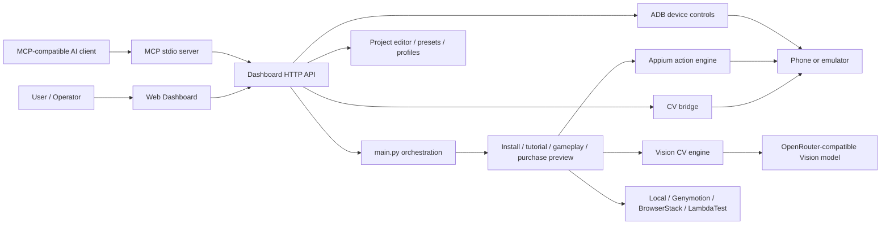
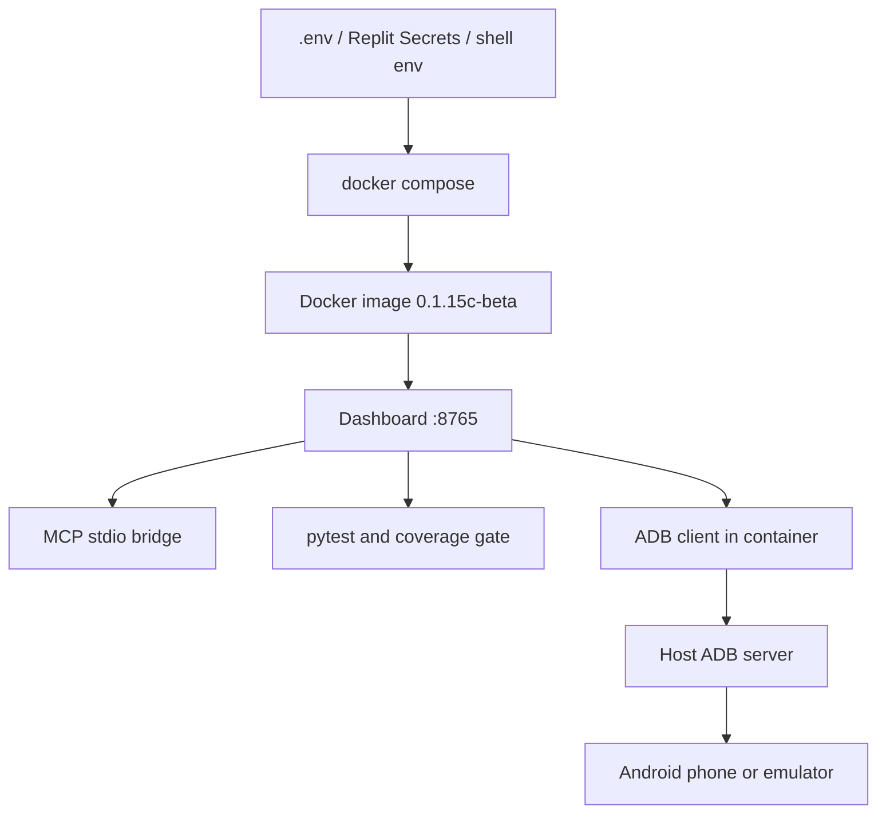
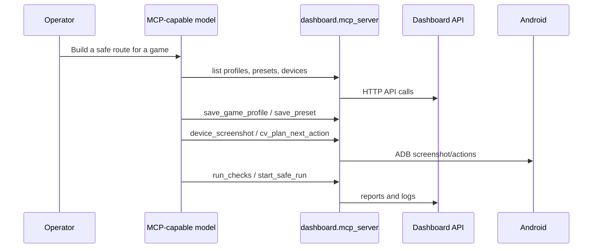

# Android Game CV Autopilot


Release: `0.1.15c-beta` · Python `3.13` · Android `ADB + Appium` ·
Docker ready · MCP ready · Tests `163 passed` · Deterministic coverage `100%` ·
Purchases `preview only`
## License

This project is source-available for non-commercial use only. Commercial use is prohibited without prior written permission. See [LICENSE](./LICENSE).

Android Game CV Autopilot is a local Android automation lab for installing
games, passing safe onboarding, running gameplay helpers, navigating to purchase
preview screens, and controlling everything from a bilingual web dashboard or an
MCP-compatible AI client.

It is designed for real Android devices and emulators connected through ADB and
Appium. The project combines a Vision/CV autopilot, manual phone control,
recorded action replay, custom game profile construction, named presets, a
project editor, test runners, and an MCP bridge.

The dashboard UI supports English and Russian.

Languages: [English](#english) | [Русский](#русская-версия)

## English

## Table Of Contents

- [What It Does](#what-it-does)
- [Safety Model](#safety-model)
- [Architecture](#architecture)
- [Requirements](#requirements)
- [Quick Start](#quick-start)
- [Docker](#docker)
- [Dashboard](#dashboard)
- [Game Profile And Preset Constructor](#game-profile-and-preset-constructor)
- [MCP Server](#mcp-server)
- [Automation Modes](#automation-modes)
- [Testing And Coverage](#testing-and-coverage)
- [Public Release Checklist](#public-release-checklist)
- [Configuration](#configuration)
- [Project Layout](#project-layout)
- [Troubleshooting](#troubleshooting)
- [Legacy Policy](#legacy-policy)

## What It Does

The project gives you a complete local control surface for Android game
automation:

- Select a connected Android device or emulator.
- Install a game from Play Store or an APK fallback.
- Use CV autopilot to pass onboarding/tutorial screens.
- Use fast local gameplay helpers for games that need real-time input.
- Record manual taps, swipes, text input, and key presses.
- Replay recorded paths as automation stages.
- Navigate to a purchase preview screen and stop before payment confirmation.
- Build new game profiles and reusable presets from the dashboard.
- Let MCP-compatible AI clients inspect, edit safe data files, test, and operate
  the system.

Built-in game profiles currently include:

| Profile | Package | Strategy |
| --- | --- | --- |
| `brawl-stars` | `com.supercell.brawlstars` | Generic CV |
| `talking-tom` | `com.outfit7.mytalkingtomfree` | Proven CV route |
| `subway-surfers` | `com.kiloo.subwaysurf` | Fast runner helper |
| `candy-crush` | `com.king.candycrushsaga` | Match-3 helper |
| `clash-royale` | `com.supercell.clashroyale` | Generic CV |
| `clash-of-clans` | `com.supercell.clashofclans` | Generic CV |

## Safety Model

This project is built for controlled testing. The dashboard and MCP bridge
enforce the same guard rules:

- `PURCHASE_MODE` is forced to `preview` by dashboard-started runs.
- CV may navigate to a shop, offer, billing preview, or price screen.
- Real `Buy`, `Pay`, `Confirm`, subscription, password, biometric, and final
  payment actions remain blocked.
- Google phone verification is manual and user-controlled.
- Preset saving strips secret fields before writing JSON.
- Dashboard project editing is intentionally limited to safe data directories:
  `dashboard/presets`, `dashboard/profiles`, `dashboard/recordings`, and
  `dashboard/prompts`. Server code, Python files, dashboard JS/CSS/HTML, logs,
  reports, caches, virtualenvs, legacy scripts, and known secret files are
  blocked from the web editor.

These restrictions are deliberate. They keep tests repeatable and prevent
accidental real purchases or account-verification abuse.

## Architecture



Core layers:

| Layer | Path | Purpose |
| --- | --- | --- |
| Orchestration | `main.py` | Stage ordering, run reports, CLI entrypoint |
| Runtime config | `config.py` | Environment-driven settings |
| CV | `core/cv_engine.py`, `core/cv_autopilot.py` | Screenshot-to-action planning and safe execution |
| Profiles | `core/game_profiles.py` | Built-in and custom game routing hints |
| Scenarios | `scenarios/` | Install, tutorial, gameplay, payment-preview flows |
| Services | `services/` | Local device, device farms, provider clients |
| Dashboard | `dashboard/server.py`, `dashboard/static/` | Web UI, HTTP API, constructor, manual mode |
| MCP | `dashboard/mcp_server.py` | AI-client bridge over stdio |
| Tests | `tests/` | Unit, mocked integration, live ADB smoke tests |

Docker runtime flow:



AI/MCP construction flow:



## Requirements

- macOS or Linux.
- Python 3.13 tested locally.
- Android SDK platform tools with `adb`.
- Appium setup for local Appium-driven runs.
- Connected Android device or emulator with USB debugging enabled.
- Optional OpenRouter-compatible Vision key for CV mode.

Install Python dependencies:

```bash
python3 -m pip install -r requirements.txt
```

Check Android devices:

```bash
adb devices -l
```

If more than one device is connected, set `LOCAL_DEVICE` to the serial shown by
`adb devices -l`:

```bash
export LOCAL_DEVICE=<adb-serial>
```

## Quick Start

Start the dashboard:

```bash
python3 -m dashboard.server
```

Open:

```text
http://127.0.0.1:8765
```

Default local login:

```text
username: admin
password: admin
```

Change dashboard credentials through environment variables:

```bash
export DASHBOARD_USERNAME=admin
export DASHBOARD_PASSWORD=change-me
export DASHBOARD_MCP_API_KEY=change-this-mcp-key
```

Recommended first run:

1. Open `Command`.
2. Select a ready preset, for example `Verified: My Talking Tom`.
3. Select the connected ADB device and click `Use For Run`.
4. Enter a Vision key if using CV mode.
5. Click `Run Checks`.
6. Click `Start Safe Run`.
7. Watch `Logs` and `Reports`.

CLI profile listing:

```bash
python3 main.py --list-games
```

CLI run example:

```bash
python3 main.py --game talking-tom --stages install,tutorial,purchase_preview
```

## Docker

Docker is the recommended reproducible deployment path for the dashboard, MCP
API surface, tests, and release checks. Secrets stay outside the image.

### Local Dashboard

```bash
cp .env.example .env
# edit .env and replace admin/change-me values before exposing the dashboard
docker compose up --build
```

Open:

```text
http://127.0.0.1:8765
```

Default local Docker login is controlled by `.env`:

```text
DASHBOARD_USERNAME=admin
DASHBOARD_PASSWORD=change-me
DASHBOARD_MCP_API_KEY=change-me
```

### Docker Tests

Run the complete Docker release check:

```bash
bash scripts/docker_check.sh
```

When the container cannot reach a host ADB server, the live ADB smoke test is
reported as skipped. That is expected for a pure Docker build check.

Or run only compose validation and tests:

```bash
docker compose config
docker compose run --rm dashboard python -m pytest -q
```

### ADB From Docker

Docker Desktop on macOS cannot directly see a USB phone. The container uses the
host ADB server through:

```text
ADB_SERVER_SOCKET=tcp:host.docker.internal:5037
```

Start a host ADB server that listens for the local container network:

```bash
adb kill-server
adb -a -P 5037 nodaemon server start
```

Keep that terminal open, then run:

```bash
docker compose up --build
docker compose exec dashboard adb devices -l
```

Use this only on a trusted local machine/network. For cloud deployment, prefer
Genymotion, BrowserStack, LambdaTest, or another explicitly reachable ADB
target.

### MCP With Docker

If your AI client runs on the host, keep MCP as a host-side stdio process and
point it to the Docker dashboard:

```json
{
  "mcpServers": {
    "android-autopilot-dashboard": {
      "command": "python3",
      "args": ["-m", "dashboard.mcp_server"],
      "cwd": "/absolute/path/to/android",
      "env": {
        "DASHBOARD_URL": "http://127.0.0.1:8765",
        "DASHBOARD_MCP_API_KEY": "change-me"
      }
    }
  }
}
```

The model can then use MCP tools to inspect devices, create profiles, save
presets, run checks, test CV, capture screenshots, and start guarded runs.

## Replit

The repository is configured for Replit. Press `Run` and Replit starts the web
dashboard through:

```bash
bash scripts/replit_start.sh
```

Replit defaults:

| Variable | Value |
| --- | --- |
| `DASHBOARD_HOST` | `0.0.0.0` |
| `DASHBOARD_PORT` | `8765` |
| `DASHBOARD_USERNAME` | `admin` |
| `DASHBOARD_PASSWORD` | `admin` |
| `DASHBOARD_MCP_API_KEY` | `admin` |
| `PURCHASE_MODE` | `preview` |
| `GOOGLE_PHONE_MODE` | `manual` |

Use Replit Secrets for real API keys:

```text
OPENROUTER_API_KEY
DASHBOARD_PASSWORD
DASHBOARD_MCP_API_KEY
GENYMOTION_API_TOKEN
BROWSERSTACK_USERNAME
BROWSERSTACK_ACCESS_KEY
LT_USERNAME
LT_ACCESS_KEY
```

Useful Replit shell commands:

```bash
bash scripts/replit_check.sh
bash scripts/replit_mcp.sh
python3 main.py --list-games
```

Important ADB note: a cloud Repl cannot see a USB phone connected to your local
computer. In Replit, use a remote device provider such as Genymotion,
BrowserStack, LambdaTest, or an ADB target reachable from the Repl. Local USB
ADB stays available when running this repo on your own machine.

## Dashboard

The dashboard is the primary control surface. It is modern, bilingual, and built
for both manual operation and AI-assisted automation.

| Section | What It Controls |
| --- | --- |
| `Command` | Game, device farm, run stages, methods, credentials, CV prompts, recordings, presets |
| `MCP` | MCP server command, client config, exposed tool names |
| `Manual` | Live screenshot, tap, swipe, key, text input, action recording, and replay |
| `CV Bench` | Write a CV goal prompt, plan one action, or run a short guarded CV loop |
| `Project` / `Data Files` | Guarded editor for safe dashboard data files only |
| `Profiles` | Create, edit, apply, and delete custom game profiles |
| `Guide` | English/Russian explanations of how the constructor works |
| `Reports` | Latest run report and check output |
| `Logs` | Tail of the dashboard-started automation process |

Dashboard API examples:

| Endpoint | Purpose |
| --- | --- |
| `GET /api/state` | Full dashboard state |
| `POST /api/run` | Start a guarded automation run |
| `POST /api/stop` | Stop an active run |
| `POST /api/check` | Compile active code, run pytest, run coverage gate |
| `GET /api/profiles` | List built-in and custom game profiles |
| `POST /api/profiles` | Save a custom profile |
| `POST /api/profiles/delete` | Delete a custom profile file |
| `GET /api/presets` | List named presets |
| `POST /api/presets` | Save a named preset |
| `POST /api/cv/plan` | Ask CV for one next action without executing |
| `POST /api/cv/run` | Run safe CV autopilot on the current screen |
| `GET /api/device/screenshot` | Capture selected Android screen |
| `POST /api/device/tap` | Tap by coordinates through ADB |
| `POST /api/device/swipe` | Swipe by coordinates through ADB |
| `POST /api/recordings/replay` | Replay a recorded action path |

Manual recorder behavior:

- Button swipes support up, down, left, and right.
- The phone screenshot also supports direct drag gestures; drag on the image to
  create a recorded `swipe`.
- Recordings keep real time between user actions by writing `pause` on the
  previous action. The last action uses `pause: 0`.
- CV Test Bench lets you type a goal prompt, plan one CV step with
  `POST /api/cv/plan`, or run a short guarded CV loop with `POST /api/cv/run`.

### Dashboard Screenshots


Login protects the local dashboard with configurable credentials. Defaults are
`admin` / `admin` for local development and can be changed through environment
variables.


`Command` is the main run builder: choose a game profile, device farm, stage
methods, CV prompts, recordings, credentials for the next run, and safe
purchase-preview behavior.


`MCP` shows the stdio command, client configuration, API key setup, and the
tool surface exposed to external AI clients.


`Manual` gives direct operator control over the selected Android screen. It can
tap, type, send keys, swipe in four directions, drag on the screenshot to create
a real swipe, record actions, and replay saved paths.


Device screenshots in the README are sanitized. They do not expose an ADB
serial or private phone content.


`CV Bench` is an interactive prompt lab. Type a goal, plan one CV action, or run
a short guarded CV loop on the current device before saving the route into a
preset.


`Data Files` is intentionally scoped to safe JSON/notes: presets, profiles,
recordings, and prompt notes. Server code and dashboard source files are not
editable from this panel.


`Profiles` is the constructor for new games. A profile defines package name,
Play Store query, CV hints, blocker words, gameplay strategy, validation notes,
and step limits.


`Guide` explains how the constructor, CV autopilot, recordings, MCP, tests, and
safety rules work.


`Reports` and `Logs` show the latest run timeline, check output, and active
dashboard-started automation log tail.

## Game Profile And Preset Constructor

The constructor lets you create automation routes for new games without editing
Python code.

Custom game profiles are saved in:

```text
dashboard/profiles/*.json
```

A profile describes:

- `id`
- game name
- Android package
- Play Store install query
- aliases
- tutorial hints
- purchase-preview hints
- blocker words
- gameplay strategy
- max tutorial/purchase steps
- notes and validation status

Named presets are saved in:

```text
dashboard/presets/*.json
```

A preset stores a complete run form:

- selected profile and package
- selected device farm
- stage list
- install/tutorial/gameplay/purchase-preview methods
- CV prompt overrides
- recorded action paths
- gameplay helper settings
- safe preview settings

Secrets are not saved into presets.

## MCP Server

Run the MCP server:

```bash
python3 -m dashboard.mcp_server
```

Example MCP client config:

```json
{
  "mcpServers": {
    "android-autopilot-dashboard": {
      "command": "python3",
      "args": ["-m", "dashboard.mcp_server"],
      "cwd": "/absolute/path/to/android",
      "env": {
        "DASHBOARD_URL": "http://127.0.0.1:8765",
        "MCP_AUTOSTART_DASHBOARD": "1",
        "DASHBOARD_MCP_API_KEY": "admin"
      }
    }
  }
}
```

The MCP bridge forwards tool calls to the dashboard HTTP API. Browser UI and AI
clients share the same run state, logs, profiles, presets, recordings, guarded
data-file editor, CV tools, device controls, and safety guards.

MCP authenticates with the dashboard through `DASHBOARD_MCP_API_KEY`. The local
default is `admin`; change it before exposing the dashboard outside localhost.

More MCP details are in [dashboard/MCP.md](dashboard/MCP.md).

### MCP Tool Groups

| Group | Tools |
| --- | --- |
| State and reports | `dashboard_state`, `tail_run_log`, `latest_report` |
| Runs and tests | `start_safe_run`, `stop_run`, `run_checks` |
| Data files | `list_project_files`, `read_project_file`, `write_project_file` |
| Recordings | `list_recordings`, `read_recording`, `save_recording`, `replay_recording` |
| Constructor | `list_game_profiles`, `save_game_profile`, `delete_game_profile`, `list_presets`, `save_preset`, `delete_preset` |
| CV | `cv_plan_next_action`, `cv_run_goal` |
| Android device | `adb_devices`, `device_screenshot`, `device_tap`, `device_swipe`, `device_key`, `device_text` |
| Manual checkpoints | `manual_continue` |

### MCP Workflows

Create a game route through an AI client:

1. Call `list_game_profiles`.
2. Call `save_game_profile` with a new profile JSON.
3. Call `save_preset` with the full run configuration.
4. Call `run_checks`.
5. Use `device_screenshot` or `cv_plan_next_action` to inspect the current UI.
6. Start the guarded run with `start_safe_run`.

Use CV through MCP:

- `cv_plan_next_action` captures a screenshot and returns a single planned UI
  action. It does not execute the action.
- `cv_run_goal` runs the safe CV loop on the connected Android screen. Risky
  payment/purchase actions stop the loop instead of being executed.

### Smart Model Workflow

You can connect a stronger MCP-compatible model and give it a high-level task,
for example:

```text
Create a safe automation preset for <game name>. Use the dashboard MCP tools to
inspect connected devices, create or update a game profile, tune CV prompts,
save a preset, run checks, inspect screenshots, and iterate until the route can
install the game, pass onboarding, and stop at purchase preview.
```

The model can then use the MCP tools end to end:

1. Read `dashboard_state` and `adb_devices`.
2. Create a new custom profile with `save_game_profile`.
3. Save a reusable route with `save_preset`.
4. Inspect the phone with `device_screenshot`.
5. Test CV behavior with `cv_plan_next_action` and `cv_run_goal`.
6. Use `run_checks` after changing profiles, presets, recordings, or prompt
   notes.
7. Start the guarded route with `start_safe_run` and monitor `tail_run_log` and
   `latest_report`.

This is the intended path for adapting the constructor to another game. The
model can edit safe dashboard data files, profiles, presets, recordings, and
prompt notes, but the dashboard/MCP file guard blocks server code and secret
files. Real purchase confirmation remains blocked by the same safety guard.

## Automation Modes

| Mode | Use Case |
| --- | --- |
| `cv` | Generic screenshot-to-action flow for installs, onboarding, menus |
| `manual` | Human-controlled step with live screen and manual checkpoint |
| `recorded` | Replay previously recorded taps/swipes/text/keys |
| `deterministic` | Hard-coded deterministic flow where available |
| `fast` | Local high-speed gameplay helper for runner-style games |
| `auto` | Select an appropriate gameplay helper from profile/config |
| `off` | Skip a stage |

Stage examples:

```bash
RUN_STAGES=install,tutorial,purchase_preview python3 main.py --game talking-tom
```

```bash
INSTALL_AUTOPILOT_VIA=cv \
GAME_AUTOPILOT_VIA=recorded \
RECORDED_TUTORIAL_PATH=dashboard/recordings/tutorial.json \
python3 main.py --game custom
```

## Testing And Coverage

Current local status:

```text
163 passed
Deterministic constructor/MCP/CV coverage gate: 100.00%
```

Run all active tests:

```bash
python3 -m pytest -q
```

Run compile checks:

```bash
python3 -m compileall -q core dashboard scenarios services tests bootstrap.py main.py config.py
```

Run the dashboard-equivalent check pipeline:

```bash
curl -sS -X POST http://127.0.0.1:8765/api/check \
  -H 'Content-Type: application/json' \
  -H 'X-Dashboard-Api-Key: admin' \
  -d '{}'
```

Run the 100% coverage gate for deterministic constructor/MCP/CV modules:

```bash
python3 -m pytest \
  tests/test_dashboard_mcp_server.py \
  tests/test_cv_prompt_templates.py \
  tests/test_dashboard_cv_bridge.py \
  tests/test_game_profiles.py \
  --cov=dashboard.mcp_server \
  --cov=core.cv_prompt_templates \
  --cov=dashboard.cv_bridge \
  --cov=core.game_profiles \
  --cov-report=term-missing \
  --cov-fail-under=100 \
  -q
```

Run mocked integration boundaries:

```bash
python3 -m pytest tests/test_integration_mocks.py -q
```

Run read-only live ADB smoke against a connected phone or emulator:

```bash
python3 -m pytest tests/test_live_adb_smoke.py -q
```

Run the dashboard i18n/UI contract tests:

```bash
python3 -m pytest tests/test_dashboard_i18n_contract.py -q
```

Run the public-surface secret scan:

```bash
bash scripts/secret_scan.sh
```

### Coverage Policy

The project separates coverage into two categories:

| Category | Coverage Target | Why |
| --- | --- | --- |
| Deterministic code | 100% gate | MCP protocol, prompt templates, CV bridge helpers, profile parsing |
| Integration code | Mocked and live tests | ADB, Appium, Google, Play Store, device farms, HTTP providers |

Full repository line coverage is intentionally not claimed as 100%. Android,
Appium, Google, Play Store, provider, and real-device flows need mocked
integration tests plus live device smoke tests, not fake unit coverage.

## Public Release Checklist

Release beta:

```text
0.1.15c-beta
```

Before publishing to a public GitHub repository:

1. Keep real secrets in `.env`, Replit Secrets, shell environment, or your MCP
   client config. Do not commit them.
2. Run the active tests:

```bash
python3 -m pytest -q
```

3. Run the deterministic 100% coverage gate:

```bash
python3 -m pytest \
  tests/test_dashboard_mcp_server.py \
  tests/test_cv_prompt_templates.py \
  tests/test_dashboard_cv_bridge.py \
  tests/test_game_profiles.py \
  --cov=dashboard.mcp_server \
  --cov=core.cv_prompt_templates \
  --cov=dashboard.cv_bridge \
  --cov=core.game_profiles \
  --cov-report=term-missing \
  --cov-fail-under=100 \
  -q
```

4. Run the secret scan:

```bash
bash scripts/secret_scan.sh
```

5. Validate Docker:

```bash
docker compose config
bash scripts/docker_check.sh
```

6. Commit and tag:

```bash
git add .
git commit -m "Release beta 0.1.15c"
git tag -a beta-0.1.15c -m "Beta 0.1.15c"
```

7. Push only after a remote is configured:

```bash
git remote add origin git@github.com:<owner>/<repo>.git
git push -u origin main
git push origin beta-0.1.15c
```

Public repo hygiene:

- `.gitignore` and `.dockerignore` exclude `.env`, `credentials.json`, logs,
  reports, traces, local screenshots, virtualenvs, caches, `legacy/`, and
  `archive/`.
- Dashboard screenshots in `docs/screenshots/` do not expose ADB serials.
- Dashboard device labels mask serials in the UI while keeping the real serial
  internally for ADB actions.
- Docker images do not bake API keys into the filesystem or image layers.

## Configuration

Most behavior is configured through environment variables and can also be set
from the dashboard form.

Common variables:

| Variable | Purpose |
| --- | --- |
| `OPENROUTER_API_KEY` | Vision model key |
| `CV_MODELS` | Comma-separated Vision model fallback list |
| `DEVICE_FARM` | `local`, `genymotion`, `browserstack`, or `lambdatest` |
| `LOCAL_DEVICE` | ADB serial or `auto` |
| `APPIUM_PORT` | Local Appium port |
| `GAME_PROFILE` | Profile id |
| `GAME_NAME` | Display/search name override |
| `GAME_PACKAGE` | Android package override |
| `RUN_STAGES` | Comma-separated stage list |
| `INSTALL_AUTOPILOT_VIA` | `cv`, `deterministic`, `manual`, `recorded` |
| `GAME_AUTOPILOT_VIA` | Tutorial/onboarding method |
| `GAMEPLAY_AUTOPILOT_VIA` | `auto`, `fast`, `manual`, `recorded`, `off` |
| `PURCHASE_AUTOPILOT_VIA` | Purchase preview method |
| `PURCHASE_MODE` | Dashboard forces `preview` |
| `RECORDED_INSTALL_PATH` | Recording path for install stage |
| `RECORDED_TUTORIAL_PATH` | Recording path for tutorial stage |
| `RECORDED_GAMEPLAY_PATH` | Recording path for gameplay stage |
| `MANUAL_CONTROL_TIMEOUT_SECONDS` | Manual checkpoint timeout |
| `DASHBOARD_AUTH_ENABLED` | Enable/disable local dashboard login, default `1` |
| `DASHBOARD_USERNAME` | Dashboard username, default `admin` |
| `DASHBOARD_PASSWORD` | Dashboard password, default `admin` |
| `DASHBOARD_SESSION_TTL_SECONDS` | Browser session lifetime |
| `DASHBOARD_MCP_API_KEY` | API key used by MCP and other non-browser clients |

Provider credentials:

| Variable | Purpose |
| --- | --- |
| `GENYMOTION_API_TOKEN` | Genymotion Cloud |
| `BROWSERSTACK_USERNAME` | BrowserStack username |
| `BROWSERSTACK_ACCESS_KEY` | BrowserStack access key |
| `LT_USERNAME` | LambdaTest username |
| `LT_ACCESS_KEY` | LambdaTest access key |
| `FIVESIM_API_KEY` | 5sim key for permitted non-Google flows |
| `GOOGLE_PHONE_NUMBER` | Manual Google phone number |
| `GOOGLE_SMS_CODE` | Manual Google SMS code |
| `GOOGLE_SMS_CODE_FILE` | File watched for manual SMS code |

Do not commit real credentials.

## Project Layout

```text
bootstrap.py                         Preflight configuration/API checks
config.py                            Environment-driven runtime config
main.py                              Automation entrypoint and stage orchestration
core/
  cv_engine.py                       Vision API client and JSON parsing
  cv_autopilot.py                    Screenshot -> plan -> guarded execution loop
  cv_prompt_templates.py             CV prompt templates
  game_profiles.py                   Built-in/custom game profile registry
  appium_action_engine.py            Device action abstraction
scenarios/
  install_game_cv.py                 Play Store/APK install flow
  game_tutorial_cv.py                First-run/tutorial CV flow
  purchase_preview_cv.py             Safe purchase-preview navigation
  fast_runner_gameplay.py            Realtime runner helper
  match3_gameplay.py                 Match-3 helper
services/
  local_farm.py                      Local ADB/Appium target
  browserstack_farm.py               BrowserStack API boundary
  lambdatest_farm.py                 LambdaTest API boundary
  genymotion_farm.py                 Genymotion API boundary
  sms_service.py                     SMS provider boundary
dashboard/
  server.py                          Web dashboard HTTP API
  mcp_server.py                      MCP stdio bridge
  cv_bridge.py                       Dashboard CV planning/execution helpers
  static/                            HTML/CSS/JS/i18n assets
  presets/                           Named run presets
  profiles/                          Custom game profile JSON files
  recordings/                        Saved manual action recordings
  prompts/                            Optional dashboard-editable prompt notes
tests/                               Active pytest suite
legacy/                              Old probes/scripts excluded from active coverage
```

## Troubleshooting

### ADB device not visible

```bash
adb devices -l
```

If the phone is missing:

- Enable USB debugging.
- Accept the RSA prompt on the phone.
- Reconnect USB or restart ADB:

```bash
adb kill-server
adb start-server
adb devices -l
```

### Multiple devices connected

Set a concrete serial:

```bash
export LOCAL_DEVICE=<adb-serial>
```

Then refresh the dashboard and click `Use For Run`.

### CV models fail

Check:

- `OPENROUTER_API_KEY` is set or entered in the dashboard.
- `CV_MODELS` contains valid Vision-capable models.
- The Android screenshot endpoint returns a PNG:

```bash
adb -s <serial> exec-out screencap -p > /tmp/android-screen.png
```

### Dashboard port is busy

Find the process:

```bash
lsof -iTCP:8765 -sTCP:LISTEN -n -P
```

Stop it or start dashboard on another port:

```bash
DASHBOARD_PORT=8766 python3 -m dashboard.server
```

### Appium/local run fails

Confirm Appium is running and that `APPIUM_PORT` matches the dashboard field:

```bash
export APPIUM_PORT=4723
```

### Play Store/game blocked by network or region

Use one of:

- another game profile,
- APK fallback path,
- manual mode,
- recorded action path,
- remote device farm with the right region.

## Legacy Policy

Old root-level probes, experiments, one-off sign-in scripts, and scratch tests
were moved to `legacy/`. They are excluded from active dashboard editing and
coverage gates.

Bring a legacy file back only after:

1. Defining the supported behavior.
2. Moving it into an active module.
3. Adding focused tests.
4. Running the full pytest suite.

## Security Notes

- Do not commit API keys, SMS credentials, cloud provider credentials, Google
  credentials, or card data.
- Dashboard presets strip known secret fields.
- Dashboard browser access is protected by login when `DASHBOARD_AUTH_ENABLED=1`.
- MCP/API clients use `X-Dashboard-Api-Key` or `Authorization: Bearer <key>`.
- The dashboard file editor is restricted to `dashboard/presets`,
  `dashboard/profiles`, `dashboard/recordings`, and `dashboard/prompts`.
- `credentials.json`, `.env`, server code, Python files, dashboard JS/CSS/HTML,
  logs, reports, caches, virtualenvs, and `legacy/` are excluded from the
  dashboard project editor.
- Real payment confirmation remains blocked by guard rules.

## Русская Версия

Android Game CV Autopilot — локальная лаборатория автоматизации Android-игр.
Проект умеет устанавливать игры, проходить безопасный onboarding/tutorial,
запускать gameplay-помощники, доходить до preview-экрана покупки и
останавливаться до реального подтверждения оплаты. Управление доступно из
двуязычного web dashboard и через MCP-совместимые AI-клиенты.

### Что Умеет

- Выбор подключенного телефона или эмулятора через ADB.
- Установка игры из Play Store или APK fallback.
- CV-автопилот по скриншотам для onboarding, tutorial и меню.
- Ручной режим с live screenshot, tap, swipe, key и text input.
- Запись действий с реальным временем между действиями.
- Воспроизведение записанных путей как этапов автоматизации.
- Конструктор игровых профилей и пресетов.
- MCP bridge, чтобы другая нейронка могла читать состояние, запускать тесты,
  управлять телефоном, использовать CV и создавать профили/пресеты.

### Безопасность

Dashboard и MCP запускают покупки только в режиме `preview`.
Реальные `Buy`, `Pay`, `Confirm`, подписки, пароль, биометрия и финальное
подтверждение оплаты заблокированы guard-правилами. Google phone verification
остается ручной и под контролем пользователя.

Редактор файлов в dashboard не редактирует код сервера. Разрешены только
безопасные data-директории:

```text
dashboard/presets
dashboard/profiles
dashboard/recordings
dashboard/prompts
```

`config.py`, `main.py`, `dashboard/server.py`, dashboard JS/CSS/HTML, секреты,
логи, отчеты, кеши, virtualenv и `legacy/` заблокированы в web-редакторе.

### Быстрый Старт

```bash
python3 -m pip install -r requirements.txt
python3 -m dashboard.server
```

Открыть:

```text
http://127.0.0.1:8765
```

Логин по умолчанию:

```text
login: admin
password: admin
```

Настройка логина и MCP API key:

```bash
export DASHBOARD_USERNAME=admin
export DASHBOARD_PASSWORD=change-me
export DASHBOARD_MCP_API_KEY=change-this-mcp-key
```

Проверить устройства:

```bash
adb devices -l
```

Если подключено несколько устройств:

```bash
export LOCAL_DEVICE=<adb-serial>
```

### Replit

Проект настроен для Replit. Кнопка `Run` запускает web dashboard через:

```bash
bash scripts/replit_start.sh
```

В Replit по умолчанию:

| Переменная | Значение |
| --- | --- |
| `DASHBOARD_HOST` | `0.0.0.0` |
| `DASHBOARD_PORT` | `8765` |
| `DASHBOARD_USERNAME` | `admin` |
| `DASHBOARD_PASSWORD` | `admin` |
| `DASHBOARD_MCP_API_KEY` | `admin` |
| `PURCHASE_MODE` | `preview` |
| `GOOGLE_PHONE_MODE` | `manual` |

Реальные ключи добавляй через Replit Secrets:

```text
OPENROUTER_API_KEY
DASHBOARD_PASSWORD
DASHBOARD_MCP_API_KEY
GENYMOTION_API_TOKEN
BROWSERSTACK_USERNAME
BROWSERSTACK_ACCESS_KEY
LT_USERNAME
LT_ACCESS_KEY
```

Полезные команды в Replit Shell:

```bash
bash scripts/replit_check.sh
bash scripts/replit_mcp.sh
python3 main.py --list-games
```

Важно про ADB: облачный Repl не увидит USB-телефон, подключенный к твоему Mac.
В Replit используй Genymotion, BrowserStack, LambdaTest или ADB target,
доступный из Repl. Локальный USB ADB работает при запуске проекта на этом ПК.

### Docker

Docker — основной воспроизводимый путь для запуска dashboard, MCP API,
тестов и release checks. Секреты не запекаются в image.

Локальный запуск dashboard:

```bash
cp .env.example .env
# отредактируй .env и замени admin/change-me перед внешним доступом
docker compose up --build
```

Открыть:

```text
http://127.0.0.1:8765
```

Логин и MCP key берутся из `.env`:

```text
DASHBOARD_USERNAME=admin
DASHBOARD_PASSWORD=change-me
DASHBOARD_MCP_API_KEY=change-me
```

Полная Docker-проверка релиза:

```bash
bash scripts/docker_check.sh
```

Если контейнер не видит host ADB server, live ADB smoke test будет помечен как
skipped. Для чистой Docker build-проверки это нормально.

Быстрая проверка Docker Compose и тестов:

```bash
docker compose config
docker compose run --rm dashboard python -m pytest -q
```

ADB из Docker на macOS работает через host ADB server:

```text
ADB_SERVER_SOCKET=tcp:host.docker.internal:5037
```

Запусти ADB server на хосте в отдельном терминале:

```bash
adb kill-server
adb -a -P 5037 nodaemon server start
```

Потом:

```bash
docker compose up --build
docker compose exec dashboard adb devices -l
```

Используй этот режим только на доверенной локальной машине/сети. Для облака
лучше использовать Genymotion, BrowserStack, LambdaTest или другой явно
доступный ADB target.

MCP с Docker: если AI-клиент работает на хосте, запускай MCP как host-side
stdio процесс и направляй его на Docker dashboard:

```json
{
  "mcpServers": {
    "android-autopilot-dashboard": {
      "command": "python3",
      "args": ["-m", "dashboard.mcp_server"],
      "cwd": "/absolute/path/to/android",
      "env": {
        "DASHBOARD_URL": "http://127.0.0.1:8765",
        "DASHBOARD_MCP_API_KEY": "change-me"
      }
    }
  }
}
```

Модель через MCP сможет смотреть устройства, создавать профили, сохранять
presets, запускать checks, тестировать CV, делать screenshots и стартовать
guarded runs.

### Dashboard

| Раздел | Назначение |
| --- | --- |
| `Command` | Игра, ферма устройств, этапы, методы, ключи, CV prompts, recordings, presets |
| `MCP` | Команда MCP server, client config, список tools |
| `Manual` | Live screen, tap, swipe, key, text, запись и replay действий |
| `CV стенд` | Цель/промпт для CV, планирование одного шага или короткий guarded CV run |
| `Project` / `Data Files` | Защищенный редактор только safe data files |
| `Profiles` | Создание, применение и удаление custom game profiles |
| `Guide` | Подробные объяснения RU/EN |
| `Reports` | Последний run report и вывод проверок |
| `Logs` | Лог процесса, запущенного из dashboard |

В ручном режиме можно:

- нажимать кнопки `Swipe Up`, `Swipe Down`, `Swipe Left`, `Swipe Right`;
- тянуть мышью/пальцем по screenshot телефона, чтобы записать настоящий swipe;
- записывать реальные интервалы: `pause` ставится на предыдущее действие, а
  последнее действие получает `pause: 0`;
- сохранять JSON в `dashboard/recordings/*.json` и потом воспроизводить.
- В CV Test Bench можно написать цель/промпт, спланировать один CV шаг через
  `POST /api/cv/plan` или запустить короткую guarded CV-цель через
  `POST /api/cv/run`.

### Скриншоты Dashboard


`Login` защищает локальный dashboard. По умолчанию логин/пароль `admin` /
`admin`, но их можно поменять через environment.


`Command` — главный конструктор запуска: игра, ферма устройств, этапы, методы,
CV prompts, recordings, credentials для следующего run и безопасный режим
purchase preview.


`MCP` показывает команду запуска stdio server, client config, API key и список
tools, доступных внешним AI-клиентам.


`Manual` дает ручное управление телефоном: tap, text, key, свайпы вверх/вниз/
влево/вправо, drag по screenshot для настоящего swipe, запись и replay paths.


Скриншоты устройства в README очищены: ADB serial и приватное содержимое
телефона не показываются.


`CV стенд` — тестовая зона для промптов. Можно написать цель, получить один
планируемый CV action или запустить короткую guarded CV loop на текущем экране.


`Data Files` редактирует только безопасные data files: presets, profiles,
recordings и prompt notes. Код сервера и dashboard source files здесь
заблокированы.


`Profiles` создает профили под новые игры: package, Play Store query, CV hints,
blocker words, gameplay strategy, notes и лимиты шагов.


`Guide` объясняет constructor, CV autopilot, recordings, MCP, тесты и safety
rules.


`Reports` и `Logs` показывают timeline последнего run, вывод проверок и tail
активного процесса автоматизации.

### MCP

Запуск MCP server:

```bash
python3 -m dashboard.mcp_server
```

Пример client config:

```json
{
  "mcpServers": {
    "android-autopilot-dashboard": {
      "command": "python3",
      "args": ["-m", "dashboard.mcp_server"],
      "cwd": "/absolute/path/to/android",
      "env": {
        "DASHBOARD_URL": "http://127.0.0.1:8765",
        "MCP_AUTOSTART_DASHBOARD": "1",
        "DASHBOARD_MCP_API_KEY": "admin"
      }
    }
  }
}
```

Основные группы tools:

| Группа | Tools |
| --- | --- |
| Состояние | `dashboard_state`, `tail_run_log`, `latest_report` |
| Запуски и тесты | `start_safe_run`, `stop_run`, `run_checks` |
| Safe data files | `list_project_files`, `read_project_file`, `write_project_file` |
| Recordings | `list_recordings`, `read_recording`, `save_recording`, `replay_recording` |
| Конструктор | `list_game_profiles`, `save_game_profile`, `delete_game_profile`, `list_presets`, `save_preset`, `delete_preset` |
| CV | `cv_plan_next_action`, `cv_run_goal` |
| Android | `adb_devices`, `device_screenshot`, `device_tap`, `device_swipe`, `device_key`, `device_text` |

Как использовать умную модель через MCP:

1. Подключи MCP server к модели, которая умеет работать с tools.
2. Дай ей задачу в стиле: “Настрой безопасный preset под `<название игры>`:
   создай профиль, подбери prompts, проверь устройство, прогони checks, посмотри
   screenshots, протестируй CV и остановись на purchase preview”.
3. Модель читает `dashboard_state`, создает `save_game_profile`, сохраняет
   `save_preset`, проверяет экран через `device_screenshot`, тестирует CV через
   `cv_plan_next_action` / `cv_run_goal`, запускает `run_checks` и смотрит
   `latest_report`.
4. Для другой игры она повторяет тот же цикл: новый profile, новый preset,
   новые hints/prompts/recordings.

MCP может редактировать только safe data files, profiles, presets, recordings и
prompt notes. Код сервера, секреты и реальные подтверждения оплаты заблокированы
guard-правилами.

### Тесты

Текущий локальный статус:

```text
163 passed
Deterministic constructor/MCP/CV coverage gate: 100.00%
```

Полный прогон:

```bash
python3 -m pytest -q
```

Проверка через dashboard API:

```bash
curl -sS -X POST http://127.0.0.1:8765/api/check \
  -H 'Content-Type: application/json' \
  -H 'X-Dashboard-Api-Key: admin' \
  -d '{}'
```

100% coverage gate для deterministic MCP/CV/constructor слоя:

```bash
python3 -m pytest \
  tests/test_dashboard_mcp_server.py \
  tests/test_cv_prompt_templates.py \
  tests/test_dashboard_cv_bridge.py \
  tests/test_game_profiles.py \
  --cov=dashboard.mcp_server \
  --cov=core.cv_prompt_templates \
  --cov=dashboard.cv_bridge \
  --cov=core.game_profiles \
  --cov-report=term-missing \
  --cov-fail-under=100 \
  -q
```

Secret scan публичной поверхности:

```bash
bash scripts/secret_scan.sh
```

### Public Release Checklist

Релиз beta:

```text
0.1.15c-beta
```

Перед публикацией на GitHub:

1. Реальные ключи держи только в `.env`, Replit Secrets, shell environment или
   MCP client config. Не коммить их.
2. Запусти тесты:

```bash
python3 -m pytest -q
```

3. Запусти deterministic coverage gate 100%:

```bash
python3 -m pytest \
  tests/test_dashboard_mcp_server.py \
  tests/test_cv_prompt_templates.py \
  tests/test_dashboard_cv_bridge.py \
  tests/test_game_profiles.py \
  --cov=dashboard.mcp_server \
  --cov=core.cv_prompt_templates \
  --cov=dashboard.cv_bridge \
  --cov=core.game_profiles \
  --cov-report=term-missing \
  --cov-fail-under=100 \
  -q
```

4. Проверь секреты:

```bash
bash scripts/secret_scan.sh
```

5. Проверь Docker:

```bash
docker compose config
bash scripts/docker_check.sh
```

6. Сделай commit и tag:

```bash
git add .
git commit -m "Release beta 0.1.15c"
git tag -a beta-0.1.15c -m "Beta 0.1.15c"
```

7. Push только после настройки remote:

```bash
git remote add origin git@github.com:<owner>/<repo>.git
git push -u origin main
git push origin beta-0.1.15c
```

Что исключено из публичного репозитория:

- `.env`, `credentials.json`, logs, reports, traces, локальные screenshots,
  virtualenv, caches, `legacy/` и `archive/`;
- dashboard screenshots в `docs/screenshots/` не показывают ADB serial;
- в UI список устройств маскирует serial как `device-1 · model`, но реальный
  serial остается внутри для ADB;
- Docker image не содержит API keys.

### Основные Переменные

| Переменная | Назначение |
| --- | --- |
| `OPENROUTER_API_KEY` | Vision model key |
| `CV_MODELS` | Список Vision models через запятую |
| `LOCAL_DEVICE` | ADB serial или `auto` |
| `GAME_PROFILE` | ID игрового профиля |
| `RUN_STAGES` | Этапы запуска через запятую |
| `INSTALL_AUTOPILOT_VIA` | `cv`, `deterministic`, `manual`, `recorded` |
| `GAME_AUTOPILOT_VIA` | Метод tutorial/onboarding |
| `GAMEPLAY_AUTOPILOT_VIA` | `auto`, `fast`, `manual`, `recorded`, `off` |
| `PURCHASE_MODE` | Dashboard принудительно использует `preview` |
| `DASHBOARD_USERNAME` | Логин dashboard, default `admin` |
| `DASHBOARD_PASSWORD` | Пароль dashboard, default `admin` |
| `DASHBOARD_MCP_API_KEY` | API key для MCP и non-browser клиентов |

Не коммить реальные API keys, SMS credentials, cloud credentials, Google
credentials или платежные данные.
