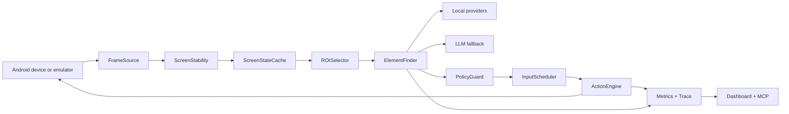
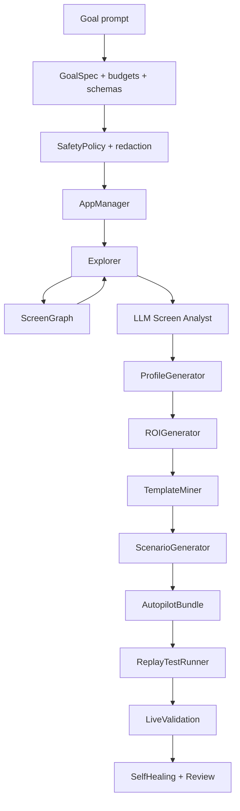

# Development Guide

This repository is an Android automation platform with three major layers:

1. Runtime execution: ADB/Appium actions, frame sources, perception, gameplay helpers.
2. Operator surface: dashboard HTTP API, web UI, Vision Inspector, Builder UI, MCP bridge.
3. Artifact generation: profiles, presets, templates, ROI zones, autopilot bundles, reports.

## Core Architecture



## Builder Architecture



## Directory Ownership

| Area | Paths |
| --- | --- |
| Runtime engine | `core/`, `scenarios/` |
| Builder | `core/autobuilder/` |
| Profile maturity/readiness | `core/profile_validation.py` |
| Dashboard API/UI | `dashboard/` |
| Safe operator data | `dashboard/presets/`, `dashboard/profiles/`, `dashboard/recordings/`, `dashboard/prompts/` |
| Templates and autopilots | `assets/templates/`, `autopilots/` |
| Documentation and screenshots | `docs/` |
| Tests | `tests/` |

## Local Development

Create the environment:

```bash
python3 -m venv .venv
source .venv/bin/activate
pip install -r requirements.txt
```

Run the dashboard:

```bash
python3 scripts/setup_doctor.py
python3 -m dashboard.server
```

Measure local reaction speed when debugging gameplay:

```bash
python3 scripts/reaction_benchmark.py --serial emulator-5554 --samples 5
python3 scripts/reaction_benchmark.py --serial 47d33e1c --samples 5 --source adb_raw
python3 scripts/reaction_benchmark.py --serial 47d33e1c --samples 5 --source scrcpy_raw --nudge-key 82
python3 scripts/profile_live_validator.py --serial 47d33e1c --profile subway-surfers --promote validated
python3 scripts/benchmark_matrix.py --serial 47d33e1c --profile subway-surfers --runs 20
```

ADB screencap can be acceptable for menus/tutorials, but active runner/action
gameplay should use `FRAME_SOURCE=scrcpy_raw`, replay, or validated minicap
frame sources with local-only providers. `adb_raw` is useful for diagnosis and
may be faster than PNG screencap, but it is not automatically realtime on every
USB device. On USB device `47d33e1c`, the latest measured values were
`adb_screencap avg_ms=617.144`, `adb_raw_screencap avg_ms=841.762`, and
`scrcpy_raw_stream avg_ms=34.138` / `p95_ms=59.464`.

Runtime paths use the shared frame-source factory: CV autopilot goals, fast
runner, match-3 gameplay, and Autopilot Builder serial capture all honor
`FRAME_SOURCE`. `SCRCPY_RAW_FALLBACK_TO_ADB=true` is intentionally enabled for
static menu/CV screens; use `scripts/reaction_benchmark.py --source scrcpy_raw`
for fallback-free stream speed checks.

App launches in `core/autobuilder/app_manager.py` resolve the launcher activity
with `cmd package resolve-activity --brief` and execute it with `am start -n`.
Do not reintroduce `monkey -p` for builder/runtime launches. ADB calls in this
manager use bounded retry/backoff for common transport races.

Vision planner output in `core/cv_engine.py` is not trusted as free-form text.
The runtime extracts JSON, validates it against a strict action schema,
whitelists actions/keys/directions, checks tap/type coordinates against the
current frame, and optionally performs one bounded JSON repair attempt through
`CV_JSON_REPAIR_ATTEMPTS`. Invalid plans are converted to safe waits.

Run the MCP bridge:

```bash
python3 -m dashboard.mcp_server
```

Run the full test suite:

```bash
python3 -m pytest
```

The repository-wide count is a deterministic regression count: unit tests,
contract tests, mocked integration boundaries, and static checks. Live evidence
is separate and should be stored as profile validation or benchmark matrix
reports under `reports/`.

Run focused 100% coverage gates:

```bash
python3 -m pytest \
  tests/test_autobuilder_budgets.py \
  tests/test_autobuilder_schemas.py \
  tests/test_autobuilder_safety_policy.py \
  tests/test_autobuilder_redaction.py \
  tests/test_goal_spec.py \
  tests/test_task_parser.py \
  tests/test_app_manager.py \
  tests/test_screen_graph.py \
  tests/test_build_context.py \
  tests/test_explorer.py \
  tests/test_screen_analyst.py \
  tests/test_profile_generator.py \
  tests/test_roi_generator.py \
  tests/test_template_miner.py \
  tests/test_scenario_generator.py \
  tests/test_artifact_store.py \
  tests/test_autopilot_bundle.py \
  tests/test_replay_test_runner.py \
  tests/test_live_validation.py \
  tests/test_self_healing.py \
  tests/test_patch_review.py \
  tests/test_autopilot_versioning.py \
  tests/test_autopilot_eval_suite.py \
  tests/test_autopilot_builder_e2e.py \
  tests/test_dashboard_builder_api.py \
  tests/test_dashboard_builder_static_ui.py \
  tests/test_autobuilder_coverage_edges.py \
  --cov=core.autobuilder \
  --cov=dashboard.api_builder \
  --cov-report=term-missing \
  --cov-fail-under=100 -q
```

```bash
python3 -m pytest \
  tests/test_config_feature_flags.py \
  tests/test_metrics.py \
  tests/test_input_scheduler.py \
  tests/test_frame_source_replay.py \
  tests/test_default_perception_factory.py \
  tests/test_roi_selector.py \
  tests/test_screen_stability.py \
  tests/test_element_fusion.py \
  tests/test_element_finder_contract.py \
  tests/test_template_provider.py \
  tests/test_uiautomator_provider.py \
  tests/test_screen_state_cache.py \
  tests/test_llm_provider.py \
  tests/test_dashboard_vision_inspector.py \
  tests/test_dashboard_vision_editing.py \
  tests/test_runner_plugin.py \
  tests/test_fast_runner_gameplay.py \
  tests/test_match3_gameplay.py \
  tests/test_match3_scoring.py \
  tests/test_detector_provider.py \
  tests/test_cv_autopilot.py \
  --cov=core.metrics \
  --cov=core.input_scheduler \
  --cov=core.frame_source \
  --cov=core.perception.defaults \
  --cov=core.perception.roi \
  --cov=core.perception.screen_stability \
  --cov=core.perception.element \
  --cov=core.perception.fusion \
  --cov=core.perception.finder \
  --cov=core.perception.template_registry \
  --cov=core.perception.providers.template_provider \
  --cov=core.perception.providers.uiautomator_provider \
  --cov=core.perception.state_cache \
  --cov=core.perception.providers.llm_provider \
  --cov=dashboard.api_vision \
  --cov=core.gameplay.base_plugin \
  --cov=core.gameplay.runner_plugin \
  --cov=core.perception.providers.detector_provider \
  --cov=scenarios.fast_runner_gameplay \
  --cov=scenarios.match3_gameplay \
  --cov=core.cv_autopilot \
  --cov-report=term-missing \
  --cov-fail-under=100 -q
```

## Screenshots And Docs

- Keep dashboard screenshots under `docs/screenshots/`.
- Screenshots in public docs must not expose ADB serials, credentials, or real account data.
- If UI changes, update the screenshot set and the matching README sections in both English and Russian.

## Safe Change Rules

- Safe web editing remains limited to dashboard data directories.
- New MCP tools must map to existing HTTP API routes or introduce tested routes in `dashboard/server.py`.
- New builder artifacts must be schema-validated and written atomically.
- Fast gameplay must remain `local_only`.
- Risky repair patches must stay review-gated.

## Recommended Change Order

1. Update core/runtime or builder logic.
2. Add or update tests first for the touched module.
3. Sync dashboard API and static UI.
4. Sync MCP server and MCP docs.
5. Update README and screenshots.
6. Run focused coverage gates, then full `pytest`.
